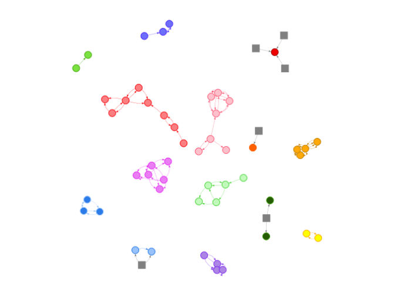

Objetivo
========

A intenção deste pacote é de disponibilizar um conjunto de funções que implementam procedimentos analíticos e de mineração de dados que se propõem a subsidiar análises voltadas para a atividade de Controle Externo Governamental.

No momento os seguintes procedimentos estão disponíveis:

-   **Práticas colusivas em licitações:** Têm por objetivo identificar situações suspeitas de prática de ação colusiva em procedimentos licitatórios. As funcões disponibilizadas pelo pacote relacionadas a este tema são:
    -   `rodizioIdentificaSituacoesSuspeitas`;
    -   `plot.TipologiaRodizio`; e
    -   `print.TipologiaRodizio`.

Caso de uso 1: aplicação na identificação de práticas colusivas em licitações
-----------------------------------------------------------------------------

A seguir será demonstrada, passo a passo, uma aplicação na identificação de práticas colusivas em licitações, numa base de dados fornecida juntamente com o pacote

### Considerações Preliminares

Juntamente com o pacote, são fornecidos dados de licitações ocorridas entre 2011 e 2015. Tais dados tiveram alguns campos "embaralhados" de maneira que dados que pudessem identificar os órgaos e empresas participantes não fossem revelados:

-   **contratos**: Dados de contratos relativos a base de licitacoes realizadas por orgaos de um ente federativo brasileiro no periodo de 2011 a 2015
-   **licitacoes**: Dados de licitacoes realizadas por orgaos de um ente federativo brasileiro no periodo de 2011 a 2015
-   **part\_lic**: Dados relatvos aos participantes de licitacoes realizadas por orgaos de um ente federativo brasileiro no periodo de 2011 a 2015

O código abaixo, quando executado, exibirá uma breve descrição das bases de dados forncidas juntamente com o pacote `RcextTools`.

``` r
data(package = 'RcextTools')
```

### Inicialmente é preciso criar um `data.frame` de acordo com o *layout* esperado.

``` r
# carrega o pacote RcextTools
library(RcextTools)

# veja o layout esperado assim: ?rcextRiscoAcaoColusiva

# carrega dados de licitacoes da base fornecida pelo pacote RcextTools
data("part_lic")

dtDados <- part_lic[!is.na(part_lic$COD_LICITACAO),]

dtDados <- data.frame(
  CNPJ = dtDados$CNPJCPF_FORNECEDORES,
  ID_LICITACAO = dtDados$COD_LICITACAO,
  ID_ITEM = dtDados$ID_ITEM,
  VENCEDOR = ifelse(dtDados$VENCEDOR == 'S', T, F),
  VALOR_ESTIMADO = NA,
  VALOR_HOMOLOGADO = as.numeric(dtDados$VALOR_FINAL),
  DESC_OBJETO = dtDados$RESUMO_OBJETO,
  stringsAsFactors = F
)

casosSuspeitos <- TipologiaRodizio(dtDados)
```

    ## Loading required package: tcltk

### Exibição dos casos suspeitos

#### Grafo representando as empresas suspeitas de prática colusiva

Os diferentes agrupamentos representam empresas suspeitas de praticarem alguma ação colusiva num determinado mercado. Cada agrupamento é representado por uma cor diferente. As arestas apontam no sentido de um perdedor para um vencedor de licitação. Empresas que são sempre perdedoras, não tendo sido vencedoras de nenhuma licitação no período analisado, são representadas por quadrados cinzas.

``` r
plot(casosSuspeitos)
```



#### Relação de contratos suspeitos

``` r
resultados <- casosSuspeitos$tabela
resultados <- unique(within(resultados, rm(list = c('VALOR_ESTIMADO', 'VENCEDOR', 'VALOR_HOMOLOGADO', 'ID_ITEM'))))
names(resultados)[names(resultados)=="TEXTO_VALOR_HOMOLOGADO"] <- "VALOR"

knitr::kable(resultados)
```

| CNPJ           |  ID\_LICITACAO| DESC\_OBJETO                             |  MERCADO\_ATUACAO| VALOR          |  PROB\_FAVORECIMENTO\_NO\_MERCADO|
|:---------------|--------------:|:-----------------------------------------|-----------------:|:---------------|---------------------------------:|
| 67905010101870 |           1219| PRESTACAO DE SERVICO GRAFICO             |                 1| R$609.500,00   |                         0.1956076|
| 67905010101870 |           5172| SERVICOS GRAFICOS EM GERAL               |                 1| R$87.300,00    |                         0.1956076|
| 69507068501680 |          13086| SES - SERVICOS GRAFICOS                  |                 1| R$45.150,00    |                         0.0485692|
| 12503073401750 |           9548| AQUISICAO LIVROS PARA O CCS              |                 1| R$38.901,64    |                         0.1041936|
| 49805091701330 |           2816| UERJ-AQUISICAO DE LIVROS                 |                 1| R$21.994,50    |                         0.0671107|
| 49805091701330 |           2816| UERJ-AQUISICAO DE LIVROS                 |                 1| R$19.916,05    |                         0.0671107|
| 22206084011020 |          12155| DPGE - CONFECCAO DE AGENDAS              |                 1| R$16.500,00    |                         0.1729863|
| 18709085201010 |           3237| AQUISICAO DE LIVROS - BIOLOGIA           |                 1| R$14.610,00    |                         0.1308809|
| 65800019471190 |           3237| AQUISICAO DE LIVROS - BIOLOGIA           |                 1| R$13.503,00    |                         0.1692586|
| 49805091701330 |           2816| UERJ-AQUISICAO DE LIVROS                 |                 1| R$13.456,80    |                         0.0671107|
| 18709085201010 |          12245| UERJ-AQUIS LIVROS ALUNOS COTISTAS        |                 1| R$13.231,68    |                         0.1308809|
| 18709085201010 |           6857| UERJ-AQUISICAO DE LIVROS                 |                 1| R$12.072,70    |                         0.1308809|
| 18709085201010 |           2816| UERJ-AQUISICAO DE LIVROS                 |                 1| R$11.930,60    |                         0.1308809|
| 18709085201010 |          12245| UERJ-AQUIS LIVROS ALUNOS COTISTAS        |                 1| R$11.502,48    |                         0.1308809|
| 69507068501680 |           8882| PRESTACAO DE SERVICOS PROD GRAFICA       |                 1| R$10.000,00    |                         0.0485692|
| 22800044501570 |           9298| AQUIS DE LIVROS CIENTIFICOS PARA O CEH   |                 1| R$9.205,30     |                         0.1113930|
| 49805091701330 |           3237| AQUISICAO DE LIVROS - BIOLOGIA           |                 1| R$8.324,16     |                         0.0671107|
| 18709085201010 |           6857| UERJ-AQUISICAO DE LIVROS                 |                 1| R$7.860,83     |                         0.1308809|
| 18709085201010 |           3237| AQUISICAO DE LIVROS - BIOLOGIA           |                 1| R$7.571,00     |                         0.1308809|
| 12503073401750 |          10814| UERJ - AQUIS LIVROS P COTISTAS DO CTC    |                 1| R$7.160,00     |                         0.1041936|
| 18709085201010 |          10814| UERJ - AQUIS LIVROS P COTISTAS DO CTC    |                 1| R$6.975,63     |                         0.1308809|
| 18709085201010 |           6857| UERJ-AQUISICAO DE LIVROS                 |                 1| R$6.955,83     |                         0.1308809|
| 12503073401750 |          10839| AQUISICAO DE LIVROS CIENTIFICOS          |                 1| R$6.836,20     |                         0.1041936|
| 65800019471190 |           3237| AQUISICAO DE LIVROS - BIOLOGIA           |                 1| R$6.690,00     |                         0.1692586|
| 65800019471190 |           3237| AQUISICAO DE LIVROS - BIOLOGIA           |                 1| R$6.335,01     |                         0.1692586|
| 65800019471190 |           3237| AQUISICAO DE LIVROS - BIOLOGIA           |                 1| R$6.277,60     |                         0.1692586|
| 69507068501680 |           8269| DPGE-CONFECCAO DE MATERIAL GRAFICO       |                 1| R$6.150,00     |                         0.0485692|
| 65800019471190 |           3237| AQUISICAO DE LIVROS - BIOLOGIA           |                 1| R$5.744,16     |                         0.1692586|
| 65800019471190 |           3237| AQUISICAO DE LIVROS - BIOLOGIA           |                 1| R$5.362,00     |                         0.1692586|
| 65800019471190 |           3237| AQUISICAO DE LIVROS - BIOLOGIA           |                 1| R$5.352,00     |                         0.1692586|
| 65800019471190 |           3237| AQUISICAO DE LIVROS - BIOLOGIA           |                 1| R$5.266,56     |                         0.1692586|
| 65800019471190 |           3237| AQUISICAO DE LIVROS - BIOLOGIA           |                 1| R$5.211,27     |                         0.1692586|
| 65800019471190 |           3237| AQUISICAO DE LIVROS - BIOLOGIA           |                 1| R$5.176,15     |                         0.1692586|
| 65800019471190 |           3237| AQUISICAO DE LIVROS - BIOLOGIA           |                 1| R$5.012,70     |                         0.1692586|
| 65800019471190 |           3237| AQUISICAO DE LIVROS - BIOLOGIA           |                 1| R$4.764,40     |                         0.1692586|
| 18709085201010 |           3237| AQUISICAO DE LIVROS - BIOLOGIA           |                 1| R$4.520,00     |                         0.1308809|
| 18709085201010 |           3237| AQUISICAO DE LIVROS - BIOLOGIA           |                 1| R$4.294,00     |                         0.1308809|
| 69507068501680 |           6628| UERJ-SERVICO DE IMPRESSAO E REPROGRAFIA  |                 1| R$4.270,00     |                         0.0485692|
| 12503073401750 |          10839| AQUISICAO DE LIVROS CIENTIFICOS          |                 1| R$4.256,00     |                         0.1041936|
| 49805091701330 |           3237| AQUISICAO DE LIVROS - BIOLOGIA           |                 1| R$4.014,00     |                         0.0671107|
| 65800019471190 |           3237| AQUISICAO DE LIVROS - BIOLOGIA           |                 1| R$4.010,47     |                         0.1692586|
| 69507068501680 |           8942| RIOPREVIDENCIA - AQUISICAO DE FOLDERS    |                 1| R$3.600,00     |                         0.0485692|
| 49805091701330 |           3237| AQUISICAO DE LIVROS - BIOLOGIA           |                 1| R$3.204,00     |                         0.0671107|
| 18709085201010 |          10814| UERJ - AQUIS LIVROS P COTISTAS DO CTC    |                 1| R$3.094,91     |                         0.1308809|
| 65800019471190 |           3237| AQUISICAO DE LIVROS - BIOLOGIA           |                 1| R$2.814,57     |                         0.1692586|
| 65800019471190 |           3237| AQUISICAO DE LIVROS - BIOLOGIA           |                 1| R$2.742,84     |                         0.1692586|
| 65800019471190 |           3237| AQUISICAO DE LIVROS - BIOLOGIA           |                 1| R$2.716,77     |                         0.1692586|
| 18709085201010 |           3373| AQUISICAO DE LIVROS                      |                 1| R$2.711,50     |                         0.1308809|
| 65800019471190 |           3237| AQUISICAO DE LIVROS - BIOLOGIA           |                 1| R$1.995,84     |                         0.1692586|
| 18709085201010 |           3373| AQUISICAO DE LIVROS                      |                 1| R$1.963,50     |                         0.1308809|
| 18709085201010 |           3373| AQUISICAO DE LIVROS                      |                 1| R$1.766,64     |                         0.1308809|
| 18709085201010 |           3373| AQUISICAO DE LIVROS                      |                 1| R$1.683,36     |                         0.1308809|
| 18709085201010 |           3237| AQUISICAO DE LIVROS - BIOLOGIA           |                 1| R$1.664,00     |                         0.1308809|
| 65800019471190 |           3237| AQUISICAO DE LIVROS - BIOLOGIA           |                 1| R$1.652,79     |                         0.1692586|
| 69507068501680 |           8942| RIOPREVIDENCIA - AQUISICAO DE FOLDERS    |                 1| R$1.600,00     |                         0.0485692|
| 69507068501680 |           9320| IPEM - CONT. SRV. CONF. MATERIAL GRAFICO |                 1| R$1.560,00     |                         0.0485692|
| 49805091701330 |           3237| AQUISICAO DE LIVROS - BIOLOGIA           |                 1| R$1.263,50     |                         0.0671107|
| 18709085201010 |           3373| AQUISICAO DE LIVROS                      |                 1| R$1.177,60     |                         0.1308809|
| 18709085201010 |           3373| AQUISICAO DE LIVROS                      |                 1| R$1.130,91     |                         0.1308809|
| 69507068501680 |           9320| IPEM - CONT. SRV. CONF. MATERIAL GRAFICO |                 1| R$1.080,00     |                         0.0485692|
| 69507068501680 |           9320| IPEM - CONT. SRV. CONF. MATERIAL GRAFICO |                 1| R$1.050,00     |                         0.0485692|
| 49805091701330 |           3237| AQUISICAO DE LIVROS - BIOLOGIA           |                 1| R$1.000,00     |                         0.0671107|
| 69507068501680 |           8942| RIOPREVIDENCIA - AQUISICAO DE FOLDERS    |                 1| R$1.000,00     |                         0.0485692|
| 18709085201010 |           3373| AQUISICAO DE LIVROS                      |                 1| R$841,59       |                         0.1308809|
| 18709085201010 |           3373| AQUISICAO DE LIVROS                      |                 1| R$823,44       |                         0.1308809|
| 18709085201010 |           3373| AQUISICAO DE LIVROS                      |                 1| R$816,66       |                         0.1308809|
| 18709085201010 |           3373| AQUISICAO DE LIVROS                      |                 1| R$811,56       |                         0.1308809|
| 18709085201010 |           3373| AQUISICAO DE LIVROS                      |                 1| R$754,53       |                         0.1308809|
| 69507068501680 |          13086| SES - SERVICOS GRAFICOS                  |                 1| R$750,00       |                         0.0485692|
| 18709085201010 |           3373| AQUISICAO DE LIVROS                      |                 1| R$736,00       |                         0.1308809|
| 18709085201010 |           3373| AQUISICAO DE LIVROS                      |                 1| R$630,00       |                         0.1308809|
| 49805091701330 |           3237| AQUISICAO DE LIVROS - BIOLOGIA           |                 1| R$560,00       |                         0.0671107|
| 65800019471190 |           3237| AQUISICAO DE LIVROS - BIOLOGIA           |                 1| R$521,76       |                         0.1692586|
| 69507068501680 |           9320| IPEM - CONT. SRV. CONF. MATERIAL GRAFICO |                 1| R$438,00       |                         0.0485692|
| 18709085201010 |           3373| AQUISICAO DE LIVROS                      |                 1| R$392,85       |                         0.1308809|
| 18709085201010 |           3373| AQUISICAO DE LIVROS                      |                 1| R$381,90       |                         0.1308809|
| 18709085201010 |           3373| AQUISICAO DE LIVROS                      |                 1| R$280,00       |                         0.1308809|
| 65800019471190 |           3237| AQUISICAO DE LIVROS - BIOLOGIA           |                 1| R$216,20       |                         0.1692586|
| 18709085201010 |           3373| AQUISICAO DE LIVROS                      |                 1| R$210,00       |                         0.1308809|
| 49805091701330 |           3355| AQUISICAO DE LIVROS                      |                 1| R$197,50       |                         0.0671107|
| 49805091701330 |           3355| AQUISICAO DE LIVROS                      |                 1| R$190,39       |                         0.0671107|
| 49805091701330 |           3355| AQUISICAO DE LIVROS                      |                 1| R$132,72       |                         0.0671107|
| 49805091701330 |           3355| AQUISICAO DE LIVROS                      |                 1| R$108,75       |                         0.0671107|
| 49805091701330 |           3355| AQUISICAO DE LIVROS                      |                 1| R$107,44       |                         0.0671107|
| 49805091701330 |           3355| AQUISICAO DE LIVROS                      |                 1| R$104,05       |                         0.0671107|
| 49805091701330 |           3355| AQUISICAO DE LIVROS                      |                 1| R$103,35       |                         0.0671107|
| 49805091701330 |           3355| AQUISICAO DE LIVROS                      |                 1| R$102,00       |                         0.0671107|
| 49805091701330 |           3355| AQUISICAO DE LIVROS                      |                 1| R$101,98       |                         0.0671107|
| 18709085201010 |           3237| AQUISICAO DE LIVROS - BIOLOGIA           |                 1| R$100,00       |                         0.1308809|
| 49805091701330 |           3355| AQUISICAO DE LIVROS                      |                 1| R$99,80        |                         0.0671107|
| 18709085201010 |           3237| AQUISICAO DE LIVROS - BIOLOGIA           |                 1| R$98,99        |                         0.1308809|
| 49805091701330 |           3355| AQUISICAO DE LIVROS                      |                 1| R$97,20        |                         0.0671107|
| 49805091701330 |           3355| AQUISICAO DE LIVROS                      |                 1| R$96,38        |                         0.0671107|
| 49805091701330 |           3355| AQUISICAO DE LIVROS                      |                 1| R$91,78        |                         0.0671107|
| 49805091701330 |           3355| AQUISICAO DE LIVROS                      |                 1| R$89,75        |                         0.0671107|
| 49805091701330 |           3355| AQUISICAO DE LIVROS                      |                 1| R$85,32        |                         0.0671107|
| 49805091701330 |           3355| AQUISICAO DE LIVROS                      |                 1| R$78,20        |                         0.0671107|
| 49805091701330 |           3355| AQUISICAO DE LIVROS                      |                 1| R$75,05        |                         0.0671107|
| 49805091701330 |           3355| AQUISICAO DE LIVROS                      |                 1| R$74,78        |                         0.0671107|
| 49805091701330 |           3355| AQUISICAO DE LIVROS                      |                 1| R$72,68        |                         0.0671107|
| 49805091701330 |           3355| AQUISICAO DE LIVROS                      |                 1| R$72,65        |                         0.0671107|
| 49805091701330 |           3355| AQUISICAO DE LIVROS                      |                 1| R$72,05        |                         0.0671107|
| 65800019471190 |          10735| PGERJ - AQUISICAO DE LIVROS JURIDICOS    |                 1| R$70,00        |                         0.1692586|
| 49805091701330 |           3355| AQUISICAO DE LIVROS                      |                 1| R$67,98        |                         0.0671107|
| 49805091701330 |           3355| AQUISICAO DE LIVROS                      |                 1| R$67,15        |                         0.0671107|
| 49805091701330 |           3355| AQUISICAO DE LIVROS                      |                 1| R$65,57        |                         0.0671107|
| 49805091701330 |           3355| AQUISICAO DE LIVROS                      |                 1| R$65,55        |                         0.0671107|
| 49805091701330 |           3355| AQUISICAO DE LIVROS                      |                 1| R$64,78        |                         0.0671107|
| 49805091701330 |           3355| AQUISICAO DE LIVROS                      |                 1| R$64,75        |                         0.0671107|
| 49805091701330 |           3355| AQUISICAO DE LIVROS                      |                 1| R$64,58        |                         0.0671107|
| 49805091701330 |           3355| AQUISICAO DE LIVROS                      |                 1| R$61,62        |                         0.0671107|
| 49805091701330 |           3355| AQUISICAO DE LIVROS                      |                 1| R$60,90        |                         0.0671107|
| 49805091701330 |           3355| AQUISICAO DE LIVROS                      |                 1| R$58,48        |                         0.0671107|
| 49805091701330 |           3355| AQUISICAO DE LIVROS                      |                 1| R$57,65        |                         0.0671107|
| 49805091701330 |           3355| AQUISICAO DE LIVROS                      |                 1| R$56,85        |                         0.0671107|
| 49805091701330 |           3355| AQUISICAO DE LIVROS                      |                 1| R$53,70        |                         0.0671107|
| 49805091701330 |           3355| AQUISICAO DE LIVROS                      |                 1| R$52,14        |                         0.0671107|
| 49805091701330 |           3355| AQUISICAO DE LIVROS                      |                 1| R$46,61        |                         0.0671107|
| 49805091701330 |           3355| AQUISICAO DE LIVROS                      |                 1| R$44,24        |                         0.0671107|
| 49805091701330 |           3355| AQUISICAO DE LIVROS                      |                 1| R$43,50        |                         0.0671107|
| 49805091701330 |           3355| AQUISICAO DE LIVROS                      |                 1| R$43,45        |                         0.0671107|
| 49805091701330 |           3355| AQUISICAO DE LIVROS                      |                 1| R$42,66        |                         0.0671107|
| 49805091701330 |           3355| AQUISICAO DE LIVROS                      |                 1| R$38,71        |                         0.0671107|
| 49805091701330 |           3355| AQUISICAO DE LIVROS                      |                 1| R$37,92        |                         0.0671107|
| 49805091701330 |           3355| AQUISICAO DE LIVROS                      |                 1| R$36,34        |                         0.0671107|
| 49805091701330 |           3355| AQUISICAO DE LIVROS                      |                 1| R$34,76        |                         0.0671107|
| 49805091701330 |           3355| AQUISICAO DE LIVROS                      |                 1| R$32,39        |                         0.0671107|
| 49805091701330 |           3355| AQUISICAO DE LIVROS                      |                 1| R$30,81        |                         0.0671107|
| 49805091701330 |           3355| AQUISICAO DE LIVROS                      |                 1| R$29,23        |                         0.0671107|
| 49805091701330 |           3355| AQUISICAO DE LIVROS                      |                 1| R$23,20        |                         0.0671107|
| 48507071801660 |           5073| AQ. DE MATERIAIS PARA NEUROCIRURGIA      |                 2| R$1.750.951,08 |                         0.2071567|
| 40803051011910 |           5073| AQ. DE MATERIAIS PARA NEUROCIRURGIA      |                 2| R$1.320.737,88 |                         0.2216633|
| 40803051011910 |           5073| AQ. DE MATERIAIS PARA NEUROCIRURGIA      |                 2| R$1.229.258,20 |                         0.2216633|
| 48507071801660 |           5073| AQ. DE MATERIAIS PARA NEUROCIRURGIA      |                 2| R$1.089.999,00 |                         0.2071567|
| 40803051011910 |           5073| AQ. DE MATERIAIS PARA NEUROCIRURGIA      |                 2| R$1.029.366,00 |                         0.2216633|
| 40803051011910 |           5073| AQ. DE MATERIAIS PARA NEUROCIRURGIA      |                 2| R$686.400,00   |                         0.2216633|
| 40803051011910 |           5073| AQ. DE MATERIAIS PARA NEUROCIRURGIA      |                 2| R$657.900,00   |                         0.2216633|
| 40803051011910 |           5073| AQ. DE MATERIAIS PARA NEUROCIRURGIA      |                 2| R$528.060,00   |                         0.2216633|
| 40803051011910 |           5073| AQ. DE MATERIAIS PARA NEUROCIRURGIA      |                 2| R$425.600,00   |                         0.2216633|
| 40803051011910 |           5073| AQ. DE MATERIAIS PARA NEUROCIRURGIA      |                 2| R$410.400,00   |                         0.2216633|
| 70904065301270 |           5073| AQ. DE MATERIAIS PARA NEUROCIRURGIA      |                 2| R$368.600,00   |                         0.2071567|
| 40803051011910 |           5073| AQ. DE MATERIAIS PARA NEUROCIRURGIA      |                 2| R$364.800,00   |                         0.2216633|
| 40803051011910 |           5073| AQ. DE MATERIAIS PARA NEUROCIRURGIA      |                 2| R$311.600,00   |                         0.2216633|
| 40803051011910 |           5073| AQ. DE MATERIAIS PARA NEUROCIRURGIA      |                 2| R$286.000,00   |                         0.2216633|
| 40803051011910 |           5073| AQ. DE MATERIAIS PARA NEUROCIRURGIA      |                 2| R$281.250,00   |                         0.2216633|
| 40803051011910 |           5073| AQ. DE MATERIAIS PARA NEUROCIRURGIA      |                 2| R$277.400,00   |                         0.2216633|
| 40803051011910 |           5073| AQ. DE MATERIAIS PARA NEUROCIRURGIA      |                 2| R$242.000,00   |                         0.2216633|
| 40803051011910 |           5073| AQ. DE MATERIAIS PARA NEUROCIRURGIA      |                 2| R$225.000,00   |                         0.2216633|
| 40803051011910 |           5073| AQ. DE MATERIAIS PARA NEUROCIRURGIA      |                 2| R$217.600,00   |                         0.2216633|
| 40803051011910 |           5073| AQ. DE MATERIAIS PARA NEUROCIRURGIA      |                 2| R$209.000,00   |                         0.2216633|
| 40803051011910 |           5073| AQ. DE MATERIAIS PARA NEUROCIRURGIA      |                 2| R$201.400,00   |                         0.2216633|
| 40803051011910 |           5073| AQ. DE MATERIAIS PARA NEUROCIRURGIA      |                 2| R$193.800,00   |                         0.2216633|
| 70904065301270 |           9662| UERJ - CONJ P/ ESTIMULACAO CEREBRAL PROF |                 2| R$173.463,53   |                         0.2071567|
| 40803051011910 |           5073| AQ. DE MATERIAIS PARA NEUROCIRURGIA      |                 2| R$170.000,00   |                         0.2216633|
| 48507071801660 |           5073| AQ. DE MATERIAIS PARA NEUROCIRURGIA      |                 2| R$169.462,80   |                         0.2071567|
| 24603022211720 |           5073| AQ. DE MATERIAIS PARA NEUROCIRURGIA      |                 2| R$165.750,00   |                         0.2071567|
| 40803051011910 |           5073| AQ. DE MATERIAIS PARA NEUROCIRURGIA      |                 2| R$165.200,00   |                         0.2216633|
| 40803051011910 |           5073| AQ. DE MATERIAIS PARA NEUROCIRURGIA      |                 2| R$163.200,00   |                         0.2216633|
| 40803051011910 |           5073| AQ. DE MATERIAIS PARA NEUROCIRURGIA      |                 2| R$161.863,68   |                         0.2216633|
| 40803051011910 |           5073| AQ. DE MATERIAIS PARA NEUROCIRURGIA      |                 2| R$160.050,00   |                         0.2216633|
| 24603022211720 |           5073| AQ. DE MATERIAIS PARA NEUROCIRURGIA      |                 2| R$157.625,00   |                         0.2071567|
| 48507071801660 |           5073| AQ. DE MATERIAIS PARA NEUROCIRURGIA      |                 2| R$156.150,61   |                         0.2071567|
| 40803051011910 |           5073| AQ. DE MATERIAIS PARA NEUROCIRURGIA      |                 2| R$147.148,80   |                         0.2216633|
| 40803051011910 |           5073| AQ. DE MATERIAIS PARA NEUROCIRURGIA      |                 2| R$139.383,22   |                         0.2216633|
| 40803051011910 |           5073| AQ. DE MATERIAIS PARA NEUROCIRURGIA      |                 2| R$129.800,00   |                         0.2216633|
| 40803051011910 |           5073| AQ. DE MATERIAIS PARA NEUROCIRURGIA      |                 2| R$129.600,00   |                         0.2216633|
| 24603022211720 |           5073| AQ. DE MATERIAIS PARA NEUROCIRURGIA      |                 2| R$129.000,00   |                         0.2071567|
| 40803051011910 |           5073| AQ. DE MATERIAIS PARA NEUROCIRURGIA      |                 2| R$125.400,00   |                         0.2216633|
| 40803051011910 |           5073| AQ. DE MATERIAIS PARA NEUROCIRURGIA      |                 2| R$124.800,00   |                         0.2216633|
| 40803051011910 |           5073| AQ. DE MATERIAIS PARA NEUROCIRURGIA      |                 2| R$124.740,00   |                         0.2216633|
| 48507071801660 |           5073| AQ. DE MATERIAIS PARA NEUROCIRURGIA      |                 2| R$121.283,61   |                         0.2071567|
| 40803051011910 |           5073| AQ. DE MATERIAIS PARA NEUROCIRURGIA      |                 2| R$118.200,30   |                         0.2216633|
| 40803051011910 |           5073| AQ. DE MATERIAIS PARA NEUROCIRURGIA      |                 2| R$115.142,66   |                         0.2216633|
| 40803051011910 |           5073| AQ. DE MATERIAIS PARA NEUROCIRURGIA      |                 2| R$112.500,00   |                         0.2216633|
| 40803051011910 |           5073| AQ. DE MATERIAIS PARA NEUROCIRURGIA      |                 2| R$110.200,00   |                         0.2216633|
| 40803051011910 |           5073| AQ. DE MATERIAIS PARA NEUROCIRURGIA      |                 2| R$106.200,00   |                         0.2216633|
| 48507071801660 |           5073| AQ. DE MATERIAIS PARA NEUROCIRURGIA      |                 2| R$103.916,80   |                         0.2071567|
| 40803051011910 |           5073| AQ. DE MATERIAIS PARA NEUROCIRURGIA      |                 2| R$102.000,00   |                         0.2216633|
| 24603022211720 |           5073| AQ. DE MATERIAIS PARA NEUROCIRURGIA      |                 2| R$99.125,00    |                         0.2071567|
| 40803051011910 |           5073| AQ. DE MATERIAIS PARA NEUROCIRURGIA      |                 2| R$94.680,00    |                         0.2216633|
| 40803051011910 |           5073| AQ. DE MATERIAIS PARA NEUROCIRURGIA      |                 2| R$94.640,00    |                         0.2216633|
| 40803051011910 |           5073| AQ. DE MATERIAIS PARA NEUROCIRURGIA      |                 2| R$94.400,00    |                         0.2216633|
| 40803051011910 |           5073| AQ. DE MATERIAIS PARA NEUROCIRURGIA      |                 2| R$92.000,00    |                         0.2216633|
| 48507071801660 |           5073| AQ. DE MATERIAIS PARA NEUROCIRURGIA      |                 2| R$89.117,10    |                         0.2071567|
| 40803051011910 |           5073| AQ. DE MATERIAIS PARA NEUROCIRURGIA      |                 2| R$88.400,00    |                         0.2216633|
| 40803051011910 |           5073| AQ. DE MATERIAIS PARA NEUROCIRURGIA      |                 2| R$84.841,96    |                         0.2216633|
| 40803051011910 |           5073| AQ. DE MATERIAIS PARA NEUROCIRURGIA      |                 2| R$83.052,81    |                         0.2216633|
| 40803051011910 |           5073| AQ. DE MATERIAIS PARA NEUROCIRURGIA      |                 2| R$82.600,00    |                         0.2216633|
| 40803051011910 |           5073| AQ. DE MATERIAIS PARA NEUROCIRURGIA      |                 2| R$80.080,00    |                         0.2216633|
| 40803051011910 |           5073| AQ. DE MATERIAIS PARA NEUROCIRURGIA      |                 2| R$79.976,78    |                         0.2216633|
| 70904065301270 |           9662| UERJ - CONJ P/ ESTIMULACAO CEREBRAL PROF |                 2| R$74.911,58    |                         0.2071567|
| 40803051011910 |           5073| AQ. DE MATERIAIS PARA NEUROCIRURGIA      |                 2| R$72.721,68    |                         0.2216633|
| 40803051011910 |           5073| AQ. DE MATERIAIS PARA NEUROCIRURGIA      |                 2| R$70.800,00    |                         0.2216633|
| 24603022211720 |           5073| AQ. DE MATERIAIS PARA NEUROCIRURGIA      |                 2| R$70.680,00    |                         0.2071567|
| 70904065301270 |           7734| AQUISICAO DE INSUMOS PARA NEUROCIRURGIA  |                 2| R$69.999,00    |                         0.2071567|
| 40803051011910 |           5073| AQ. DE MATERIAIS PARA NEUROCIRURGIA      |                 2| R$68.400,00    |                         0.2216633|
| 40803051011910 |           5073| AQ. DE MATERIAIS PARA NEUROCIRURGIA      |                 2| R$66.661,54    |                         0.2216633|
| 40803051011910 |           5073| AQ. DE MATERIAIS PARA NEUROCIRURGIA      |                 2| R$64.800,00    |                         0.2216633|
| 40803051011910 |           5073| AQ. DE MATERIAIS PARA NEUROCIRURGIA      |                 2| R$62.400,00    |                         0.2216633|
| 40803051011910 |           5073| AQ. DE MATERIAIS PARA NEUROCIRURGIA      |                 2| R$59.000,00    |                         0.2216633|
| 40803051011910 |           5073| AQ. DE MATERIAIS PARA NEUROCIRURGIA      |                 2| R$57.000,00    |                         0.2216633|
| 40803051011910 |           5073| AQ. DE MATERIAIS PARA NEUROCIRURGIA      |                 2| R$56.250,00    |                         0.2216633|
| 40803051011910 |           5073| AQ. DE MATERIAIS PARA NEUROCIRURGIA      |                 2| R$52.292,51    |                         0.2216633|
| 24603022211720 |           5073| AQ. DE MATERIAIS PARA NEUROCIRURGIA      |                 2| R$51.660,00    |                         0.2071567|
| 40803051011910 |           5073| AQ. DE MATERIAIS PARA NEUROCIRURGIA      |                 2| R$47.200,00    |                         0.2216633|
| 40803051011910 |           5073| AQ. DE MATERIAIS PARA NEUROCIRURGIA      |                 2| R$46.140,45    |                         0.2216633|
| 40803051011910 |           5073| AQ. DE MATERIAIS PARA NEUROCIRURGIA      |                 2| R$43.738,24    |                         0.2216633|
| 40803051011910 |           5073| AQ. DE MATERIAIS PARA NEUROCIRURGIA      |                 2| R$43.064,42    |                         0.2216633|
| 40803051011910 |           5073| AQ. DE MATERIAIS PARA NEUROCIRURGIA      |                 2| R$40.800,00    |                         0.2216633|
| 49304053001370 |           8530| UERJ - AQUISICAO DE KIT DE MONITORIZACAO |                 2| R$40.129,99    |                         0.0455801|
| 70904065301270 |           9662| UERJ - CONJ P/ ESTIMULACAO CEREBRAL PROF |                 2| R$37.865,98    |                         0.2071567|
| 40803051011910 |           5073| AQ. DE MATERIAIS PARA NEUROCIRURGIA      |                 2| R$37.800,12    |                         0.2216633|
| 40803051011910 |           5073| AQ. DE MATERIAIS PARA NEUROCIRURGIA      |                 2| R$37.440,00    |                         0.2216633|
| 40803051011910 |           5073| AQ. DE MATERIAIS PARA NEUROCIRURGIA      |                 2| R$37.380,00    |                         0.2216633|
| 40803051011910 |           5073| AQ. DE MATERIAIS PARA NEUROCIRURGIA      |                 2| R$37.009,28    |                         0.2216633|
| 40803051011910 |           5073| AQ. DE MATERIAIS PARA NEUROCIRURGIA      |                 2| R$36.912,36    |                         0.2216633|
| 40803051011910 |           5073| AQ. DE MATERIAIS PARA NEUROCIRURGIA      |                 2| R$35.400,00    |                         0.2216633|
| 40803051011910 |           5073| AQ. DE MATERIAIS PARA NEUROCIRURGIA      |                 2| R$33.836,33    |                         0.2216633|
| 40803051011910 |           5073| AQ. DE MATERIAIS PARA NEUROCIRURGIA      |                 2| R$33.750,00    |                         0.2216633|
| 70904065301270 |           9662| UERJ - CONJ P/ ESTIMULACAO CEREBRAL PROF |                 2| R$28.757,92    |                         0.2071567|
| 40803051011910 |           5073| AQ. DE MATERIAIS PARA NEUROCIRURGIA      |                 2| R$27.684,27    |                         0.2216633|
| 40803051011910 |           5073| AQ. DE MATERIAIS PARA NEUROCIRURGIA      |                 2| R$27.200,00    |                         0.2216633|
| 40803051011910 |           5073| AQ. DE MATERIAIS PARA NEUROCIRURGIA      |                 2| R$26.166,00    |                         0.2216633|
| 40803051011910 |           5073| AQ. DE MATERIAIS PARA NEUROCIRURGIA      |                 2| R$24.999,82    |                         0.2216633|
| 40803051011910 |           5073| AQ. DE MATERIAIS PARA NEUROCIRURGIA      |                 2| R$24.608,24    |                         0.2216633|
| 40803051011910 |           5073| AQ. DE MATERIAIS PARA NEUROCIRURGIA      |                 2| R$23.670,00    |                         0.2216633|
| 49304053001370 |           8530| UERJ - AQUISICAO DE KIT DE MONITORIZACAO |                 2| R$23.666,51    |                         0.0455801|
| 24603022211720 |           5073| AQ. DE MATERIAIS PARA NEUROCIRURGIA      |                 2| R$19.200,00    |                         0.2071567|
| 40803051011910 |           5073| AQ. DE MATERIAIS PARA NEUROCIRURGIA      |                 2| R$18.456,18    |                         0.2216633|
| 40803051011910 |           5073| AQ. DE MATERIAIS PARA NEUROCIRURGIA      |                 2| R$18.319,00    |                         0.2216633|
| 49304053001370 |           8530| UERJ - AQUISICAO DE KIT DE MONITORIZACAO |                 2| R$18.092,39    |                         0.0455801|
| 40803051011910 |           5073| AQ. DE MATERIAIS PARA NEUROCIRURGIA      |                 2| R$17.910,00    |                         0.2216633|
| 40803051011910 |           5073| AQ. DE MATERIAIS PARA NEUROCIRURGIA      |                 2| R$17.000,00    |                         0.2216633|
| 40803051011910 |           5073| AQ. DE MATERIAIS PARA NEUROCIRURGIA      |                 2| R$15.380,15    |                         0.2216633|
| 40803051011910 |           5073| AQ. DE MATERIAIS PARA NEUROCIRURGIA      |                 2| R$11.214,00    |                         0.2216633|
| 40803051011910 |           5073| AQ. DE MATERIAIS PARA NEUROCIRURGIA      |                 2| R$9.228,09     |                         0.2216633|
| 80302006101010 |           7400| AQUISICAO DE INSUMOS PARA HEMODINAMICA   |                 2| R$8.300,00     |                         0.0455801|
| 24603022211720 |           5073| AQ. DE MATERIAIS PARA NEUROCIRURGIA      |                 2| R$6.960,00     |                         0.2071567|
| 80302006101010 |           7400| AQUISICAO DE INSUMOS PARA HEMODINAMICA   |                 2| R$6.600,00     |                         0.0455801|
| 40803051011910 |           5073| AQ. DE MATERIAIS PARA NEUROCIRURGIA      |                 2| R$6.152,06     |                         0.2216633|
| 80302006101010 |           7400| AQUISICAO DE INSUMOS PARA HEMODINAMICA   |                 2| R$4.300,00     |                         0.0455801|
| 80302006101010 |           7400| AQUISICAO DE INSUMOS PARA HEMODINAMICA   |                 2| R$4.150,00     |                         0.0455801|
| 80302006101010 |           7400| AQUISICAO DE INSUMOS PARA HEMODINAMICA   |                 2| R$3.310,00     |                         0.0455801|
| 80302006101010 |           7400| AQUISICAO DE INSUMOS PARA HEMODINAMICA   |                 2| R$3.200,00     |                         0.0455801|
| 80302006101010 |           7400| AQUISICAO DE INSUMOS PARA HEMODINAMICA   |                 2| R$2.500,00     |                         0.0455801|
| 80302006101010 |           7400| AQUISICAO DE INSUMOS PARA HEMODINAMICA   |                 2| R$2.450,00     |                         0.0455801|
| 80302006101010 |           7400| AQUISICAO DE INSUMOS PARA HEMODINAMICA   |                 2| R$2.000,00     |                         0.0455801|
| 80302006101010 |           7400| AQUISICAO DE INSUMOS PARA HEMODINAMICA   |                 2| R$1.800,00     |                         0.0455801|
| 93109067801020 |           7400| AQUISICAO DE INSUMOS PARA HEMODINAMICA   |                 2| R$1.650,00     |                         0.0657064|
| 80302006101010 |           7400| AQUISICAO DE INSUMOS PARA HEMODINAMICA   |                 2| R$1.500,00     |                         0.0455801|
| 80302006101010 |           7400| AQUISICAO DE INSUMOS PARA HEMODINAMICA   |                 2| R$1.490,00     |                         0.0455801|
| 80302006101010 |           7400| AQUISICAO DE INSUMOS PARA HEMODINAMICA   |                 2| R$1.465,00     |                         0.0455801|
| 80302006101010 |           7400| AQUISICAO DE INSUMOS PARA HEMODINAMICA   |                 2| R$1.450,00     |                         0.0455801|
| 80302006101010 |           7400| AQUISICAO DE INSUMOS PARA HEMODINAMICA   |                 2| R$1.365,00     |                         0.0455801|
| 80302006101010 |           7400| AQUISICAO DE INSUMOS PARA HEMODINAMICA   |                 2| R$1.300,00     |                         0.0455801|
| 93109067801020 |           7400| AQUISICAO DE INSUMOS PARA HEMODINAMICA   |                 2| R$660,00       |                         0.0657064|
| 53102021401970 |          14424| IVB - AQ MAT PRIMAS P PRODU SORO HIPERIM |                 3| R$159.960,00   |                         0.2293071|
| 69100025038230 |          14182| IVB - AQ MODULOS DE FILTRACAO TANGENCIAL |                 3| R$101.530,00   |                         0.2396165|
| 53102021401970 |          14404| IVB - AQ LUV TOUC SAPAT E RESP DESCARTAV |                 3| R$59.400,00    |                         0.2293071|
| 53102021401970 |          14424| IVB - AQ MAT PRIMAS P PRODU SORO HIPERIM |                 3| R$53.289,45    |                         0.2293071|
| 37807084011600 |           5188| INEA AQUIS.MATERIAL LABORATORIO - GELAB  |                 3| R$40.500,00    |                         0.0768438|
| 76504008211300 |          13923| INEA AQUIS DE KIT ANALISE CIANOTOXINAS   |                 3| R$35.100,00    |                         0.2755518|
| 53102021401970 |          14424| IVB - AQ MAT PRIMAS P PRODU SORO HIPERIM |                 3| R$30.484,28    |                         0.2293071|
| 37807084011600 |           5188| INEA AQUIS.MATERIAL LABORATORIO - GELAB  |                 3| R$28.980,00    |                         0.0768438|
| 53102021401970 |          14404| IVB - AQ LUV TOUC SAPAT E RESP DESCARTAV |                 3| R$27.600,00    |                         0.2293071|
| 76504008211300 |           7003| INEA AQUIS.KIT ANALISE CIANOTOXINA       |                 3| R$20.412,37    |                         0.2755518|
| 76504008211300 |          13923| INEA AQUIS DE KIT ANALISE CIANOTOXINAS   |                 3| R$16.500,00    |                         0.2755518|
| 76504008211300 |          13923| INEA AQUIS DE KIT ANALISE CIANOTOXINAS   |                 3| R$16.000,00    |                         0.2755518|
| 76504008211300 |           7003| INEA AQUIS.KIT ANALISE CIANOTOXINA       |                 3| R$7.285,53     |                         0.2755518|
| 37807084011600 |           4599| INEA AQUIS.DE CONSUMIVEIS MILLI-Q        |                 3| R$6.605,54     |                         0.0768438|
| 64502015771230 |          14424| IVB - AQ MAT PRIMAS P PRODU SORO HIPERIM |                 3| R$6.250,00     |                         0.1786808|
| 53102021401970 |          14404| IVB - AQ LUV TOUC SAPAT E RESP DESCARTAV |                 3| R$6.000,00     |                         0.2293071|
| 37807084011600 |           4599| INEA AQUIS.DE CONSUMIVEIS MILLI-Q        |                 3| R$3.183,78     |                         0.0768438|
| 37807084011600 |           4599| INEA AQUIS.DE CONSUMIVEIS MILLI-Q        |                 3| R$2.147,85     |                         0.0768438|
| 37807084011600 |           4599| INEA AQUIS.DE CONSUMIVEIS MILLI-Q        |                 3| R$1.802,87     |                         0.0768438|
| 53102021401970 |          14404| IVB - AQ LUV TOUC SAPAT E RESP DESCARTAV |                 3| R$1.200,00     |                         0.2293071|
| 64502015771230 |          14424| IVB - AQ MAT PRIMAS P PRODU SORO HIPERIM |                 3| R$765,00       |                         0.1786808|
| 37807084011600 |           5188| INEA AQUIS.MATERIAL LABORATORIO - GELAB  |                 3| R$420,00       |                         0.0768438|
| 37807084011600 |           4599| INEA AQUIS.DE CONSUMIVEIS MILLI-Q        |                 3| R$339,98       |                         0.0768438|
| 37807084011600 |           5188| INEA AQUIS.MATERIAL LABORATORIO - GELAB  |                 3| R$320,00       |                         0.0768438|
| 37807084011600 |           4599| INEA AQUIS.DE CONSUMIVEIS MILLI-Q        |                 3| R$279,98       |                         0.0768438|
| 14102038311440 |           6665| AQUISICAO DE POLTRONA RECLINAVEL         |                 4| R$2.197.500,00 |                         0.5419847|
| 35005072801720 |           9997| HUPE - VENTILADOR PULMONAR               |                 5| R$726.900,00   |                         0.3701299|
| 45006099003410 |           8864| UERJ - AQUIS VENTILADOR PULMONAR P UTIP  |                 5| R$444.000,00   |                         0.3701299|
| 58205066001910 |           5382| HUPE - AQUIS AR CONDICIONADO VRF         |                 6| R$196.000,00   |                         0.0500000|
| 34907019471720 |           5504| MAN. DE AR CONDICIONA CENTRAL            |                 6| R$120.129,84   |                         0.4635135|
| 58205066001910 |           2622| UERJ-FORNECIMENTO E INSTALACAO DE AR     |                 6| R$92.800,00    |                         0.0500000|
| 58205066001910 |           3470| CONDICIONADORES DE AR COM INSTALACAO     |                 6| R$44.863,31    |                         0.0500000|
| 58205066001910 |           3470| CONDICIONADORES DE AR COM INSTALACAO     |                 6| R$43.512,90    |                         0.0500000|
| 20006050501490 |           4619| MANUTENCAO DE CONDICIONADORES DE AR      |                 6| R$38.376,00    |                         0.4864865|
| 58205066001910 |           3470| CONDICIONADORES DE AR COM INSTALACAO     |                 6| R$30.861,76    |                         0.0500000|
| 58205066001910 |           3470| CONDICIONADORES DE AR COM INSTALACAO     |                 6| R$18.239,58    |                         0.0500000|
| 58205066001910 |           3470| CONDICIONADORES DE AR COM INSTALACAO     |                 6| R$16.600,50    |                         0.0500000|
| 58205066001910 |           3470| CONDICIONADORES DE AR COM INSTALACAO     |                 6| R$16.179,00    |                         0.0500000|
| 20006050501490 |           4236| LOTERJ - MANUTENCAO DE AR CONDICIONADOS  |                 6| R$15.240,00    |                         0.4864865|
| 72506059001310 |           3182| COBERTOR E COLCHONETE                    |                 7| R$792.819,58   |                         0.5000000|
| 72506059001310 |           3182| COBERTOR E COLCHONETE                    |                 7| R$746.079,62   |                         0.5000000|
| 28706003801070 |           6029| DEGASE - AQUISICAO DE COLCHAO            |                 7| R$499.550,00   |                         0.5000000|
| 72506059001310 |           1377| CONFECCAO DE CAMISAS                     |                 7| R$77.000,00    |                         0.5000000|
| 48909095101430 |           7701| PE AQUIS. DE GENEROS ALIMENTICIOS        |                 8| R$1.245.749,94 |                         0.2355413|
| 48909095101430 |           7701| PE AQUIS. DE GENEROS ALIMENTICIOS        |                 8| R$814.835,96   |                         0.2355413|
| 20709077901110 |           9059| FAETEC-AQUISICAO DE GENEROS ALIMENTICIOS |                 8| R$706.359,76   |                         0.1334254|
| 20709077901110 |           9059| FAETEC-AQUISICAO DE GENEROS ALIMENTICIOS |                 8| R$665.736,77   |                         0.1334254|
| 10309045611300 |           7701| PE AQUIS. DE GENEROS ALIMENTICIOS        |                 8| R$599.000,00   |                         0.2304361|
| 48909095101430 |           7701| PE AQUIS. DE GENEROS ALIMENTICIOS        |                 8| R$547.199,97   |                         0.2355413|
| 10309045611300 |           7701| PE AQUIS. DE GENEROS ALIMENTICIOS        |                 8| R$469.000,00   |                         0.2304361|
| 10309045611300 |           7701| PE AQUIS. DE GENEROS ALIMENTICIOS        |                 8| R$404.600,00   |                         0.2304361|
| 20709077901110 |           9059| FAETEC-AQUISICAO DE GENEROS ALIMENTICIOS |                 8| R$355.229,28   |                         0.1334254|
| 20709077901110 |           7701| PE AQUIS. DE GENEROS ALIMENTICIOS        |                 8| R$342.278,54   |                         0.1334254|
| 20709077901110 |           7701| PE AQUIS. DE GENEROS ALIMENTICIOS        |                 8| R$335.162,62   |                         0.1334254|
| 48909095101430 |           6646| HUPE - AQUIS GENERO ALIMENTICIOS         |                 8| R$318.920,00   |                         0.2355413|
| 20709077901110 |           5732| FAETEC-AQUISICAO GENEROS ALIMENTICIOS    |                 8| R$302.963,85   |                         0.1334254|
| 67003044801930 |           7701| PE AQUIS. DE GENEROS ALIMENTICIOS        |                 8| R$291.028,20   |                         0.4005972|
| 67003044801930 |           7701| PE AQUIS. DE GENEROS ALIMENTICIOS        |                 8| R$259.470,00   |                         0.4005972|
| 67003044801930 |           7701| PE AQUIS. DE GENEROS ALIMENTICIOS        |                 8| R$247.830,00   |                         0.4005972|
| 48909095101430 |           7701| PE AQUIS. DE GENEROS ALIMENTICIOS        |                 8| R$232.062,99   |                         0.2355413|
| 48909095101430 |           7701| PE AQUIS. DE GENEROS ALIMENTICIOS        |                 8| R$203.434,99   |                         0.2355413|
| 67003044801930 |           7701| PE AQUIS. DE GENEROS ALIMENTICIOS        |                 8| R$190.095,60   |                         0.4005972|
| 20709077901110 |           7701| PE AQUIS. DE GENEROS ALIMENTICIOS        |                 8| R$179.748,36   |                         0.1334254|
| 10309045611300 |           7701| PE AQUIS. DE GENEROS ALIMENTICIOS        |                 8| R$173.550,00   |                         0.2304361|
| 48909095101430 |           7701| PE AQUIS. DE GENEROS ALIMENTICIOS        |                 8| R$172.598,99   |                         0.2355413|
| 48909095101430 |           7701| PE AQUIS. DE GENEROS ALIMENTICIOS        |                 8| R$172.431,99   |                         0.2355413|
| 67003044801930 |           6646| HUPE - AQUIS GENERO ALIMENTICIOS         |                 8| R$165.600,00   |                         0.4005972|
| 67003044801930 |           7701| PE AQUIS. DE GENEROS ALIMENTICIOS        |                 8| R$157.850,00   |                         0.4005972|
| 48909095101430 |           7701| PE AQUIS. DE GENEROS ALIMENTICIOS        |                 8| R$153.625,99   |                         0.2355413|
| 20709077901110 |           9059| FAETEC-AQUISICAO DE GENEROS ALIMENTICIOS |                 8| R$151.868,95   |                         0.1334254|
| 20709077901110 |           9059| FAETEC-AQUISICAO DE GENEROS ALIMENTICIOS |                 8| R$143.884,95   |                         0.1334254|
| 20709077901110 |           7701| PE AQUIS. DE GENEROS ALIMENTICIOS        |                 8| R$133.924,86   |                         0.1334254|
| 48909095101430 |           6646| HUPE - AQUIS GENERO ALIMENTICIOS         |                 8| R$129.960,00   |                         0.2355413|
| 20709077901110 |           5732| FAETEC-AQUISICAO GENEROS ALIMENTICIOS    |                 8| R$128.226,68   |                         0.1334254|
| 48909095101430 |           6646| HUPE - AQUIS GENERO ALIMENTICIOS         |                 8| R$127.330,00   |                         0.2355413|
| 20709077901110 |           9059| FAETEC-AQUISICAO DE GENEROS ALIMENTICIOS |                 8| R$125.173,96   |                         0.1334254|
| 20709077901110 |           9059| FAETEC-AQUISICAO DE GENEROS ALIMENTICIOS |                 8| R$123.204,96   |                         0.1334254|
| 20709077901110 |           9059| FAETEC-AQUISICAO DE GENEROS ALIMENTICIOS |                 8| R$121.398,96   |                         0.1334254|
| 20709077901110 |           9059| FAETEC-AQUISICAO DE GENEROS ALIMENTICIOS |                 8| R$119.466,96   |                         0.1334254|
| 20709077901110 |           9059| FAETEC-AQUISICAO DE GENEROS ALIMENTICIOS |                 8| R$115.626,96   |                         0.1334254|
| 20709077901110 |           9059| FAETEC-AQUISICAO DE GENEROS ALIMENTICIOS |                 8| R$115.171,96   |                         0.1334254|
| 20709077901110 |           7701| PE AQUIS. DE GENEROS ALIMENTICIOS        |                 8| R$111.584,50   |                         0.1334254|
| 48909095101430 |           7701| PE AQUIS. DE GENEROS ALIMENTICIOS        |                 8| R$111.054,99   |                         0.2355413|
| 20709077901110 |           9059| FAETEC-AQUISICAO DE GENEROS ALIMENTICIOS |                 8| R$110.414,96   |                         0.1334254|
| 20709077901110 |           5732| FAETEC-AQUISICAO GENEROS ALIMENTICIOS    |                 8| R$109.693,98   |                         0.1334254|
| 48909095101430 |           7701| PE AQUIS. DE GENEROS ALIMENTICIOS        |                 8| R$107.519,00   |                         0.2355413|
| 67003044801930 |           7701| PE AQUIS. DE GENEROS ALIMENTICIOS        |                 8| R$107.060,00   |                         0.4005972|
| 20709077901110 |           7701| PE AQUIS. DE GENEROS ALIMENTICIOS        |                 8| R$98.363,72    |                         0.1334254|
| 20709077901110 |           5732| FAETEC-AQUISICAO GENEROS ALIMENTICIOS    |                 8| R$96.330,64    |                         0.1334254|
| 20709077901110 |           9059| FAETEC-AQUISICAO DE GENEROS ALIMENTICIOS |                 8| R$94.376,72    |                         0.1334254|
| 48909095101430 |           7701| PE AQUIS. DE GENEROS ALIMENTICIOS        |                 8| R$91.243,00    |                         0.2355413|
| 20709077901110 |           5732| FAETEC-AQUISICAO GENEROS ALIMENTICIOS    |                 8| R$90.208,18    |                         0.1334254|
| 20709077901110 |           5732| FAETEC-AQUISICAO GENEROS ALIMENTICIOS    |                 8| R$89.529,30    |                         0.1334254|
| 67003044801930 |           7701| PE AQUIS. DE GENEROS ALIMENTICIOS        |                 8| R$88.932,50    |                         0.4005972|
| 67003044801930 |           6646| HUPE - AQUIS GENERO ALIMENTICIOS         |                 8| R$87.740,00    |                         0.4005972|
| 20709077901110 |           5732| FAETEC-AQUISICAO GENEROS ALIMENTICIOS    |                 8| R$87.277,13    |                         0.1334254|
| 20709077901110 |           3082| AQUISICAO DE GENEROS ALIMENTICIOS        |                 8| R$86.774,40    |                         0.1334254|
| 10309045611300 |           7701| PE AQUIS. DE GENEROS ALIMENTICIOS        |                 8| R$86.122,40    |                         0.2304361|
| 67003044801930 |           7701| PE AQUIS. DE GENEROS ALIMENTICIOS        |                 8| R$86.004,72    |                         0.4005972|
| 20709077901110 |           7701| PE AQUIS. DE GENEROS ALIMENTICIOS        |                 8| R$84.189,90    |                         0.1334254|
| 20709077901110 |           9059| FAETEC-AQUISICAO DE GENEROS ALIMENTICIOS |                 8| R$82.747,68    |                         0.1334254|
| 67003044801930 |           7701| PE AQUIS. DE GENEROS ALIMENTICIOS        |                 8| R$81.000,00    |                         0.4005972|
| 48909095101430 |           7701| PE AQUIS. DE GENEROS ALIMENTICIOS        |                 8| R$77.663,00    |                         0.2355413|
| 48909095101430 |           7701| PE AQUIS. DE GENEROS ALIMENTICIOS        |                 8| R$76.347,00    |                         0.2355413|
| 67003044801930 |           7701| PE AQUIS. DE GENEROS ALIMENTICIOS        |                 8| R$76.320,00    |                         0.4005972|
| 20709077901110 |           7701| PE AQUIS. DE GENEROS ALIMENTICIOS        |                 8| R$72.309,18    |                         0.1334254|
| 20709077901110 |           3082| AQUISICAO DE GENEROS ALIMENTICIOS        |                 8| R$71.814,80    |                         0.1334254|
| 10309045611300 |           7701| PE AQUIS. DE GENEROS ALIMENTICIOS        |                 8| R$68.080,00    |                         0.2304361|
| 20709077901110 |           5732| FAETEC-AQUISICAO GENEROS ALIMENTICIOS    |                 8| R$68.019,12    |                         0.1334254|
| 20709077901110 |           7701| PE AQUIS. DE GENEROS ALIMENTICIOS        |                 8| R$67.303,12    |                         0.1334254|
| 20709077901110 |           7701| PE AQUIS. DE GENEROS ALIMENTICIOS        |                 8| R$66.742,36    |                         0.1334254|
| 20709077901110 |           7701| PE AQUIS. DE GENEROS ALIMENTICIOS        |                 8| R$65.698,14    |                         0.1334254|
| 20709077901110 |           9059| FAETEC-AQUISICAO DE GENEROS ALIMENTICIOS |                 8| R$64.990,98    |                         0.1334254|
| 20709077901110 |           9059| FAETEC-AQUISICAO DE GENEROS ALIMENTICIOS |                 8| R$64.450,16    |                         0.1334254|
| 20709077901110 |           9059| FAETEC-AQUISICAO DE GENEROS ALIMENTICIOS |                 8| R$63.477,98    |                         0.1334254|
| 20709077901110 |           9059| FAETEC-AQUISICAO DE GENEROS ALIMENTICIOS |                 8| R$62.935,98    |                         0.1334254|
| 67003044801930 |           7701| PE AQUIS. DE GENEROS ALIMENTICIOS        |                 8| R$61.230,24    |                         0.4005972|
| 10309045611300 |           7701| PE AQUIS. DE GENEROS ALIMENTICIOS        |                 8| R$60.400,00    |                         0.2304361|
| 67003044801930 |           7701| PE AQUIS. DE GENEROS ALIMENTICIOS        |                 8| R$58.825,00    |                         0.4005972|
| 20709077901110 |           3082| AQUISICAO DE GENEROS ALIMENTICIOS        |                 8| R$58.147,25    |                         0.1334254|
| 67003044801930 |           7701| PE AQUIS. DE GENEROS ALIMENTICIOS        |                 8| R$54.760,00    |                         0.4005972|
| 20709077901110 |           7701| PE AQUIS. DE GENEROS ALIMENTICIOS        |                 8| R$54.688,35    |                         0.1334254|
| 20709077901110 |           9059| FAETEC-AQUISICAO DE GENEROS ALIMENTICIOS |                 8| R$54.439,98    |                         0.1334254|
| 20709077901110 |           5732| FAETEC-AQUISICAO GENEROS ALIMENTICIOS    |                 8| R$53.062,17    |                         0.1334254|
| 20709077901110 |           9059| FAETEC-AQUISICAO DE GENEROS ALIMENTICIOS |                 8| R$52.076,98    |                         0.1334254|
| 20709077901110 |           9059| FAETEC-AQUISICAO DE GENEROS ALIMENTICIOS |                 8| R$51.879,98    |                         0.1334254|
| 20709077901110 |           9059| FAETEC-AQUISICAO DE GENEROS ALIMENTICIOS |                 8| R$51.273,98    |                         0.1334254|
| 20709077901110 |           5732| FAETEC-AQUISICAO GENEROS ALIMENTICIOS    |                 8| R$48.534,53    |                         0.1334254|
| 20709077901110 |           5732| FAETEC-AQUISICAO GENEROS ALIMENTICIOS    |                 8| R$48.224,75    |                         0.1334254|
| 20709077901110 |           5732| FAETEC-AQUISICAO GENEROS ALIMENTICIOS    |                 8| R$47.925,86    |                         0.1334254|
| 67003044801930 |           7701| PE AQUIS. DE GENEROS ALIMENTICIOS        |                 8| R$47.217,50    |                         0.4005972|
| 10309045611300 |           7701| PE AQUIS. DE GENEROS ALIMENTICIOS        |                 8| R$45.750,00    |                         0.2304361|
| 20709077901110 |           9059| FAETEC-AQUISICAO DE GENEROS ALIMENTICIOS |                 8| R$45.152,98    |                         0.1334254|
| 20709077901110 |           3082| AQUISICAO DE GENEROS ALIMENTICIOS        |                 8| R$44.438,85    |                         0.1334254|
| 20709077901110 |           3082| AQUISICAO DE GENEROS ALIMENTICIOS        |                 8| R$43.659,00    |                         0.1334254|
| 48909095101430 |           7701| PE AQUIS. DE GENEROS ALIMENTICIOS        |                 8| R$43.586,00    |                         0.2355413|
| 20709077901110 |           9059| FAETEC-AQUISICAO DE GENEROS ALIMENTICIOS |                 8| R$43.529,60    |                         0.1334254|
| 48909095101430 |           7701| PE AQUIS. DE GENEROS ALIMENTICIOS        |                 8| R$43.092,00    |                         0.2355413|
| 67003044801930 |           7701| PE AQUIS. DE GENEROS ALIMENTICIOS        |                 8| R$43.014,00    |                         0.4005972|
| 20709077901110 |           3082| AQUISICAO DE GENEROS ALIMENTICIOS        |                 8| R$42.900,00    |                         0.1334254|
| 20709077901110 |           5732| FAETEC-AQUISICAO GENEROS ALIMENTICIOS    |                 8| R$41.468,98    |                         0.1334254|
| 20709077901110 |           9059| FAETEC-AQUISICAO DE GENEROS ALIMENTICIOS |                 8| R$39.302,99    |                         0.1334254|
| 20709077901110 |           9059| FAETEC-AQUISICAO DE GENEROS ALIMENTICIOS |                 8| R$39.215,99    |                         0.1334254|
| 20709077901110 |           9059| FAETEC-AQUISICAO DE GENEROS ALIMENTICIOS |                 8| R$39.169,99    |                         0.1334254|
| 20709077901110 |           3082| AQUISICAO DE GENEROS ALIMENTICIOS        |                 8| R$39.038,50    |                         0.1334254|
| 20709077901110 |           5732| FAETEC-AQUISICAO GENEROS ALIMENTICIOS    |                 8| R$38.111,02    |                         0.1334254|
| 20709077901110 |           3082| AQUISICAO DE GENEROS ALIMENTICIOS        |                 8| R$37.979,90    |                         0.1334254|
| 10309045611300 |           7701| PE AQUIS. DE GENEROS ALIMENTICIOS        |                 8| R$37.824,00    |                         0.2304361|
| 20709077901110 |           9059| FAETEC-AQUISICAO DE GENEROS ALIMENTICIOS |                 8| R$37.514,99    |                         0.1334254|
| 10309045611300 |           7701| PE AQUIS. DE GENEROS ALIMENTICIOS        |                 8| R$36.848,00    |                         0.2304361|
| 20709077901110 |           5732| FAETEC-AQUISICAO GENEROS ALIMENTICIOS    |                 8| R$35.727,75    |                         0.1334254|
| 20709077901110 |           5732| FAETEC-AQUISICAO GENEROS ALIMENTICIOS    |                 8| R$35.363,00    |                         0.1334254|
| 67003044801930 |           7701| PE AQUIS. DE GENEROS ALIMENTICIOS        |                 8| R$35.360,00    |                         0.4005972|
| 20709077901110 |           5732| FAETEC-AQUISICAO GENEROS ALIMENTICIOS    |                 8| R$34.841,94    |                         0.1334254|
| 48909095101430 |           7701| PE AQUIS. DE GENEROS ALIMENTICIOS        |                 8| R$33.836,00    |                         0.2355413|
| 48909095101430 |           7701| PE AQUIS. DE GENEROS ALIMENTICIOS        |                 8| R$32.175,00    |                         0.2355413|
| 20709077901110 |           7701| PE AQUIS. DE GENEROS ALIMENTICIOS        |                 8| R$32.150,58    |                         0.1334254|
| 20709077901110 |           7701| PE AQUIS. DE GENEROS ALIMENTICIOS        |                 8| R$31.215,60    |                         0.1334254|
| 20709077901110 |           7701| PE AQUIS. DE GENEROS ALIMENTICIOS        |                 8| R$31.003,32    |                         0.1334254|
| 20709077901110 |           9059| FAETEC-AQUISICAO DE GENEROS ALIMENTICIOS |                 8| R$30.605,99    |                         0.1334254|
| 20709077901110 |           5732| FAETEC-AQUISICAO GENEROS ALIMENTICIOS    |                 8| R$30.428,25    |                         0.1334254|
| 20709077901110 |           3082| AQUISICAO DE GENEROS ALIMENTICIOS        |                 8| R$30.360,96    |                         0.1334254|
| 20709077901110 |           9059| FAETEC-AQUISICAO DE GENEROS ALIMENTICIOS |                 8| R$30.204,99    |                         0.1334254|
| 20709077901110 |           9059| FAETEC-AQUISICAO DE GENEROS ALIMENTICIOS |                 8| R$30.038,40    |                         0.1334254|
| 20709077901110 |           9059| FAETEC-AQUISICAO DE GENEROS ALIMENTICIOS |                 8| R$29.160,99    |                         0.1334254|
| 20709077901110 |           7701| PE AQUIS. DE GENEROS ALIMENTICIOS        |                 8| R$28.999,12    |                         0.1334254|
| 20709077901110 |           5732| FAETEC-AQUISICAO GENEROS ALIMENTICIOS    |                 8| R$28.921,90    |                         0.1334254|
| 20709077901110 |           3082| AQUISICAO DE GENEROS ALIMENTICIOS        |                 8| R$28.588,20    |                         0.1334254|
| 67003044801930 |           7701| PE AQUIS. DE GENEROS ALIMENTICIOS        |                 8| R$28.486,80    |                         0.4005972|
| 20709077901110 |           3082| AQUISICAO DE GENEROS ALIMENTICIOS        |                 8| R$28.137,48    |                         0.1334254|
| 20709077901110 |           5732| FAETEC-AQUISICAO GENEROS ALIMENTICIOS    |                 8| R$28.014,93    |                         0.1334254|
| 10309045611300 |           7701| PE AQUIS. DE GENEROS ALIMENTICIOS        |                 8| R$27.539,05    |                         0.2304361|
| 20709077901110 |           9059| FAETEC-AQUISICAO DE GENEROS ALIMENTICIOS |                 8| R$26.401,99    |                         0.1334254|
| 67003044801930 |           7701| PE AQUIS. DE GENEROS ALIMENTICIOS        |                 8| R$26.395,20    |                         0.4005972|
| 20709077901110 |           5732| FAETEC-AQUISICAO GENEROS ALIMENTICIOS    |                 8| R$26.206,20    |                         0.1334254|
| 48909095101430 |           7701| PE AQUIS. DE GENEROS ALIMENTICIOS        |                 8| R$25.091,00    |                         0.2355413|
| 67003044801930 |           7701| PE AQUIS. DE GENEROS ALIMENTICIOS        |                 8| R$24.663,10    |                         0.4005972|
| 67003044801930 |           6646| HUPE - AQUIS GENERO ALIMENTICIOS         |                 8| R$24.000,00    |                         0.4005972|
| 48909095101430 |           7701| PE AQUIS. DE GENEROS ALIMENTICIOS        |                 8| R$23.782,00    |                         0.2355413|
| 20709077901110 |           3082| AQUISICAO DE GENEROS ALIMENTICIOS        |                 8| R$23.680,08    |                         0.1334254|
| 20709077901110 |           3082| AQUISICAO DE GENEROS ALIMENTICIOS        |                 8| R$23.468,40    |                         0.1334254|
| 67003044801930 |           7701| PE AQUIS. DE GENEROS ALIMENTICIOS        |                 8| R$22.716,40    |                         0.4005972|
| 20709077901110 |           3082| AQUISICAO DE GENEROS ALIMENTICIOS        |                 8| R$22.655,60    |                         0.1334254|
| 20709077901110 |           9059| FAETEC-AQUISICAO DE GENEROS ALIMENTICIOS |                 8| R$22.637,99    |                         0.1334254|
| 20709077901110 |           9059| FAETEC-AQUISICAO DE GENEROS ALIMENTICIOS |                 8| R$22.202,99    |                         0.1334254|
| 20709077901110 |           5732| FAETEC-AQUISICAO GENEROS ALIMENTICIOS    |                 8| R$22.159,04    |                         0.1334254|
| 20709077901110 |           3082| AQUISICAO DE GENEROS ALIMENTICIOS        |                 8| R$21.725,34    |                         0.1334254|
| 20709077901110 |           9059| FAETEC-AQUISICAO DE GENEROS ALIMENTICIOS |                 8| R$21.688,99    |                         0.1334254|
| 67003044801930 |           7701| PE AQUIS. DE GENEROS ALIMENTICIOS        |                 8| R$21.600,00    |                         0.4005972|
| 20709077901110 |           3082| AQUISICAO DE GENEROS ALIMENTICIOS        |                 8| R$21.017,62    |                         0.1334254|
| 20709077901110 |           5732| FAETEC-AQUISICAO GENEROS ALIMENTICIOS    |                 8| R$20.229,93    |                         0.1334254|
| 20709077901110 |           3082| AQUISICAO DE GENEROS ALIMENTICIOS        |                 8| R$19.752,00    |                         0.1334254|
| 20709077901110 |           5732| FAETEC-AQUISICAO GENEROS ALIMENTICIOS    |                 8| R$19.471,80    |                         0.1334254|
| 10309045611300 |           9981| UERJ-AQUISICAO DE GENEROS ALIMENTICIOS   |                 8| R$19.404,30    |                         0.2304361|
| 10309045611300 |           6951| SRP - REFRIGERANTES E OUTRAS BEBIDAS     |                 8| R$19.126,70    |                         0.2304361|
| 20709077901110 |           3082| AQUISICAO DE GENEROS ALIMENTICIOS        |                 8| R$19.038,14    |                         0.1334254|
| 20709077901110 |           3082| AQUISICAO DE GENEROS ALIMENTICIOS        |                 8| R$18.854,64    |                         0.1334254|
| 67003044801930 |           9981| UERJ-AQUISICAO DE GENEROS ALIMENTICIOS   |                 8| R$18.834,00    |                         0.4005972|
| 20709077901110 |           9059| FAETEC-AQUISICAO DE GENEROS ALIMENTICIOS |                 8| R$18.802,99    |                         0.1334254|
| 20709077901110 |           5732| FAETEC-AQUISICAO GENEROS ALIMENTICIOS    |                 8| R$18.465,92    |                         0.1334254|
| 10309045611300 |           7701| PE AQUIS. DE GENEROS ALIMENTICIOS        |                 8| R$18.168,00    |                         0.2304361|
| 48909095101430 |           7701| PE AQUIS. DE GENEROS ALIMENTICIOS        |                 8| R$18.068,00    |                         0.2355413|
| 20709077901110 |           3082| AQUISICAO DE GENEROS ALIMENTICIOS        |                 8| R$17.992,80    |                         0.1334254|
| 10309045611300 |           7701| PE AQUIS. DE GENEROS ALIMENTICIOS        |                 8| R$17.774,36    |                         0.2304361|
| 20709077901110 |           9059| FAETEC-AQUISICAO DE GENEROS ALIMENTICIOS |                 8| R$17.579,52    |                         0.1334254|
| 20709077901110 |           9059| FAETEC-AQUISICAO DE GENEROS ALIMENTICIOS |                 8| R$16.993,99    |                         0.1334254|
| 20709077901110 |           3082| AQUISICAO DE GENEROS ALIMENTICIOS        |                 8| R$16.499,28    |                         0.1334254|
| 20709077901110 |           9059| FAETEC-AQUISICAO DE GENEROS ALIMENTICIOS |                 8| R$16.388,99    |                         0.1334254|
| 20709077901110 |           5732| FAETEC-AQUISICAO GENEROS ALIMENTICIOS    |                 8| R$16.231,68    |                         0.1334254|
| 48909095101430 |           7701| PE AQUIS. DE GENEROS ALIMENTICIOS        |                 8| R$15.825,00    |                         0.2355413|
| 10309045611300 |           7701| PE AQUIS. DE GENEROS ALIMENTICIOS        |                 8| R$15.729,00    |                         0.2304361|
| 20709077901110 |           9059| FAETEC-AQUISICAO DE GENEROS ALIMENTICIOS |                 8| R$15.353,99    |                         0.1334254|
| 10309045611300 |           7701| PE AQUIS. DE GENEROS ALIMENTICIOS        |                 8| R$15.100,80    |                         0.2304361|
| 67003044801930 |           7701| PE AQUIS. DE GENEROS ALIMENTICIOS        |                 8| R$15.040,00    |                         0.4005972|
| 20709077901110 |           3082| AQUISICAO DE GENEROS ALIMENTICIOS        |                 8| R$14.663,52    |                         0.1334254|
| 20709077901110 |           3082| AQUISICAO DE GENEROS ALIMENTICIOS        |                 8| R$14.627,74    |                         0.1334254|
| 20709077901110 |           3082| AQUISICAO DE GENEROS ALIMENTICIOS        |                 8| R$14.520,00    |                         0.1334254|
| 20709077901110 |           9059| FAETEC-AQUISICAO DE GENEROS ALIMENTICIOS |                 8| R$14.499,00    |                         0.1334254|
| 20709077901110 |           3082| AQUISICAO DE GENEROS ALIMENTICIOS        |                 8| R$14.439,14    |                         0.1334254|
| 20709077901110 |           3082| AQUISICAO DE GENEROS ALIMENTICIOS        |                 8| R$14.328,62    |                         0.1334254|
| 67003044801930 |           7701| PE AQUIS. DE GENEROS ALIMENTICIOS        |                 8| R$14.211,20    |                         0.4005972|
| 20709077901110 |           5732| FAETEC-AQUISICAO GENEROS ALIMENTICIOS    |                 8| R$14.174,36    |                         0.1334254|
| 20709077901110 |           9059| FAETEC-AQUISICAO DE GENEROS ALIMENTICIOS |                 8| R$14.168,00    |                         0.1334254|
| 20709077901110 |           3082| AQUISICAO DE GENEROS ALIMENTICIOS        |                 8| R$14.124,60    |                         0.1334254|
| 20709077901110 |           9059| FAETEC-AQUISICAO DE GENEROS ALIMENTICIOS |                 8| R$14.122,00    |                         0.1334254|
| 67003044801930 |           7701| PE AQUIS. DE GENEROS ALIMENTICIOS        |                 8| R$14.054,00    |                         0.4005972|
| 67003044801930 |           7701| PE AQUIS. DE GENEROS ALIMENTICIOS        |                 8| R$14.052,50    |                         0.4005972|
| 20709077901110 |           9059| FAETEC-AQUISICAO DE GENEROS ALIMENTICIOS |                 8| R$13.948,00    |                         0.1334254|
| 10309045611300 |           7701| PE AQUIS. DE GENEROS ALIMENTICIOS        |                 8| R$13.680,00    |                         0.2304361|
| 48909095101430 |           7701| PE AQUIS. DE GENEROS ALIMENTICIOS        |                 8| R$13.520,00    |                         0.2355413|
| 20709077901110 |           9059| FAETEC-AQUISICAO DE GENEROS ALIMENTICIOS |                 8| R$13.455,00    |                         0.1334254|
| 20709077901110 |           9059| FAETEC-AQUISICAO DE GENEROS ALIMENTICIOS |                 8| R$13.379,00    |                         0.1334254|
| 67003044801930 |           7701| PE AQUIS. DE GENEROS ALIMENTICIOS        |                 8| R$13.168,00    |                         0.4005972|
| 20709077901110 |           3082| AQUISICAO DE GENEROS ALIMENTICIOS        |                 8| R$13.121,60    |                         0.1334254|
| 67003044801930 |           7701| PE AQUIS. DE GENEROS ALIMENTICIOS        |                 8| R$13.073,40    |                         0.4005972|
| 10309045611300 |           7701| PE AQUIS. DE GENEROS ALIMENTICIOS        |                 8| R$13.002,66    |                         0.2304361|
| 20709077901110 |           3082| AQUISICAO DE GENEROS ALIMENTICIOS        |                 8| R$12.971,00    |                         0.1334254|
| 20709077901110 |           3082| AQUISICAO DE GENEROS ALIMENTICIOS        |                 8| R$12.963,00    |                         0.1334254|
| 10309045611300 |           7701| PE AQUIS. DE GENEROS ALIMENTICIOS        |                 8| R$12.914,00    |                         0.2304361|
| 20709077901110 |           5732| FAETEC-AQUISICAO GENEROS ALIMENTICIOS    |                 8| R$12.749,45    |                         0.1334254|
| 10309045611300 |           6951| SRP - REFRIGERANTES E OUTRAS BEBIDAS     |                 8| R$12.708,65    |                         0.2304361|
| 20709077901110 |           9059| FAETEC-AQUISICAO DE GENEROS ALIMENTICIOS |                 8| R$12.274,32    |                         0.1334254|
| 48909095101430 |           7701| PE AQUIS. DE GENEROS ALIMENTICIOS        |                 8| R$11.969,00    |                         0.2355413|
| 20709077901110 |           9059| FAETEC-AQUISICAO DE GENEROS ALIMENTICIOS |                 8| R$11.773,36    |                         0.1334254|
| 67003044801930 |           7701| PE AQUIS. DE GENEROS ALIMENTICIOS        |                 8| R$11.700,00    |                         0.4005972|
| 20709077901110 |           5732| FAETEC-AQUISICAO GENEROS ALIMENTICIOS    |                 8| R$11.653,06    |                         0.1334254|
| 20709077901110 |           3082| AQUISICAO DE GENEROS ALIMENTICIOS        |                 8| R$11.443,50    |                         0.1334254|
| 20709077901110 |           3082| AQUISICAO DE GENEROS ALIMENTICIOS        |                 8| R$11.376,00    |                         0.1334254|
| 10309045611300 |           7701| PE AQUIS. DE GENEROS ALIMENTICIOS        |                 8| R$11.250,00    |                         0.2304361|
| 20709077901110 |           3082| AQUISICAO DE GENEROS ALIMENTICIOS        |                 8| R$11.236,50    |                         0.1334254|
| 20709077901110 |           3082| AQUISICAO DE GENEROS ALIMENTICIOS        |                 8| R$11.185,30    |                         0.1334254|
| 20709077901110 |           3082| AQUISICAO DE GENEROS ALIMENTICIOS        |                 8| R$11.047,20    |                         0.1334254|
| 20709077901110 |           3082| AQUISICAO DE GENEROS ALIMENTICIOS        |                 8| R$10.926,00    |                         0.1334254|
| 20709077901110 |           3082| AQUISICAO DE GENEROS ALIMENTICIOS        |                 8| R$10.721,90    |                         0.1334254|
| 20709077901110 |           9059| FAETEC-AQUISICAO DE GENEROS ALIMENTICIOS |                 8| R$10.622,00    |                         0.1334254|
| 10309045611300 |           6951| SRP - REFRIGERANTES E OUTRAS BEBIDAS     |                 8| R$10.523,65    |                         0.2304361|
| 48909095101430 |           7701| PE AQUIS. DE GENEROS ALIMENTICIOS        |                 8| R$10.395,00    |                         0.2355413|
| 20709077901110 |           9059| FAETEC-AQUISICAO DE GENEROS ALIMENTICIOS |                 8| R$10.383,00    |                         0.1334254|
| 20709077901110 |           3082| AQUISICAO DE GENEROS ALIMENTICIOS        |                 8| R$10.248,90    |                         0.1334254|
| 67003044801930 |           7701| PE AQUIS. DE GENEROS ALIMENTICIOS        |                 8| R$10.180,00    |                         0.4005972|
| 20709077901110 |           9059| FAETEC-AQUISICAO DE GENEROS ALIMENTICIOS |                 8| R$10.151,04    |                         0.1334254|
| 67003044801930 |           6571| UERJ - GEN ALIMENTICIOS CEADS            |                 8| R$10.080,00    |                         0.4005972|
| 20709077901110 |           9059| FAETEC-AQUISICAO DE GENEROS ALIMENTICIOS |                 8| R$9.952,00     |                         0.1334254|
| 20709077901110 |           3082| AQUISICAO DE GENEROS ALIMENTICIOS        |                 8| R$9.872,40     |                         0.1334254|
| 20709077901110 |           5732| FAETEC-AQUISICAO GENEROS ALIMENTICIOS    |                 8| R$9.741,22     |                         0.1334254|
| 20709077901110 |           5732| FAETEC-AQUISICAO GENEROS ALIMENTICIOS    |                 8| R$9.666,40     |                         0.1334254|
| 20709077901110 |           9059| FAETEC-AQUISICAO DE GENEROS ALIMENTICIOS |                 8| R$9.546,00     |                         0.1334254|
| 20709077901110 |           3082| AQUISICAO DE GENEROS ALIMENTICIOS        |                 8| R$9.461,04     |                         0.1334254|
| 20709077901110 |           3082| AQUISICAO DE GENEROS ALIMENTICIOS        |                 8| R$9.453,60     |                         0.1334254|
| 48909095101430 |           7701| PE AQUIS. DE GENEROS ALIMENTICIOS        |                 8| R$9.452,00     |                         0.2355413|
| 10309045611300 |           7490| SESEG - AQUISICAO DE ACUCAR              |                 8| R$9.417,50     |                         0.2304361|
| 20709077901110 |           3082| AQUISICAO DE GENEROS ALIMENTICIOS        |                 8| R$9.134,40     |                         0.1334254|
| 20709077901110 |           9059| FAETEC-AQUISICAO DE GENEROS ALIMENTICIOS |                 8| R$9.112,00     |                         0.1334254|
| 20709077901110 |           5732| FAETEC-AQUISICAO GENEROS ALIMENTICIOS    |                 8| R$9.093,12     |                         0.1334254|
| 20709077901110 |           5732| FAETEC-AQUISICAO GENEROS ALIMENTICIOS    |                 8| R$9.066,33     |                         0.1334254|
| 20709077901110 |           3082| AQUISICAO DE GENEROS ALIMENTICIOS        |                 8| R$8.880,00     |                         0.1334254|
| 48909095101430 |           7701| PE AQUIS. DE GENEROS ALIMENTICIOS        |                 8| R$8.722,00     |                         0.2355413|
| 67003044801930 |           9981| UERJ-AQUISICAO DE GENEROS ALIMENTICIOS   |                 8| R$8.700,00     |                         0.4005972|
| 10309045611300 |           7701| PE AQUIS. DE GENEROS ALIMENTICIOS        |                 8| R$8.596,00     |                         0.2304361|
| 67003044801930 |           7701| PE AQUIS. DE GENEROS ALIMENTICIOS        |                 8| R$8.537,04     |                         0.4005972|
| 20709077901110 |           9059| FAETEC-AQUISICAO DE GENEROS ALIMENTICIOS |                 8| R$8.529,00     |                         0.1334254|
| 10309045611300 |           7754| FORNECIMENTO DE ACUCAR, CAFE E ADOCANTE  |                 8| R$8.370,00     |                         0.2304361|
| 10309045611300 |           6951| SRP - REFRIGERANTES E OUTRAS BEBIDAS     |                 8| R$8.308,86     |                         0.2304361|
| 67003044801930 |           7701| PE AQUIS. DE GENEROS ALIMENTICIOS        |                 8| R$8.290,00     |                         0.4005972|
| 10309045611300 |           7701| PE AQUIS. DE GENEROS ALIMENTICIOS        |                 8| R$8.177,58     |                         0.2304361|
| 67003044801930 |           7701| PE AQUIS. DE GENEROS ALIMENTICIOS        |                 8| R$8.046,00     |                         0.4005972|
| 10309045611300 |           6951| SRP - REFRIGERANTES E OUTRAS BEBIDAS     |                 8| R$7.915,86     |                         0.2304361|
| 20709077901110 |           3082| AQUISICAO DE GENEROS ALIMENTICIOS        |                 8| R$7.841,55     |                         0.1334254|
| 20709077901110 |           3082| AQUISICAO DE GENEROS ALIMENTICIOS        |                 8| R$7.805,02     |                         0.1334254|
| 67003044801930 |           9981| UERJ-AQUISICAO DE GENEROS ALIMENTICIOS   |                 8| R$7.801,92     |                         0.4005972|
| 20709077901110 |           9059| FAETEC-AQUISICAO DE GENEROS ALIMENTICIOS |                 8| R$7.765,00     |                         0.1334254|
| 10309045611300 |           7701| PE AQUIS. DE GENEROS ALIMENTICIOS        |                 8| R$7.687,50     |                         0.2304361|
| 20709077901110 |           5732| FAETEC-AQUISICAO GENEROS ALIMENTICIOS    |                 8| R$7.667,64     |                         0.1334254|
| 10309045611300 |           6951| SRP - REFRIGERANTES E OUTRAS BEBIDAS     |                 8| R$7.565,60     |                         0.2304361|
| 67003044801930 |           7701| PE AQUIS. DE GENEROS ALIMENTICIOS        |                 8| R$7.526,00     |                         0.4005972|
| 20709077901110 |           3082| AQUISICAO DE GENEROS ALIMENTICIOS        |                 8| R$7.521,30     |                         0.1334254|
| 20709077901110 |           5732| FAETEC-AQUISICAO GENEROS ALIMENTICIOS    |                 8| R$7.456,41     |                         0.1334254|
| 20709077901110 |           3082| AQUISICAO DE GENEROS ALIMENTICIOS        |                 8| R$7.407,00     |                         0.1334254|
| 20709077901110 |           5732| FAETEC-AQUISICAO GENEROS ALIMENTICIOS    |                 8| R$7.400,25     |                         0.1334254|
| 20709077901110 |           9059| FAETEC-AQUISICAO DE GENEROS ALIMENTICIOS |                 8| R$7.326,00     |                         0.1334254|
| 20709077901110 |           9059| FAETEC-AQUISICAO DE GENEROS ALIMENTICIOS |                 8| R$7.308,00     |                         0.1334254|
| 67003044801930 |           7701| PE AQUIS. DE GENEROS ALIMENTICIOS        |                 8| R$7.287,50     |                         0.4005972|
| 67003044801930 |           6571| UERJ - GEN ALIMENTICIOS CEADS            |                 8| R$7.200,00     |                         0.4005972|
| 20709077901110 |           9059| FAETEC-AQUISICAO DE GENEROS ALIMENTICIOS |                 8| R$7.185,00     |                         0.1334254|
| 20709077901110 |           5732| FAETEC-AQUISICAO GENEROS ALIMENTICIOS    |                 8| R$7.061,92     |                         0.1334254|
| 67003044801930 |           7701| PE AQUIS. DE GENEROS ALIMENTICIOS        |                 8| R$7.026,00     |                         0.4005972|
| 10309045611300 |           9981| UERJ-AQUISICAO DE GENEROS ALIMENTICIOS   |                 8| R$6.996,00     |                         0.2304361|
| 67003044801930 |           7701| PE AQUIS. DE GENEROS ALIMENTICIOS        |                 8| R$6.953,65     |                         0.4005972|
| 67003044801930 |           6571| UERJ - GEN ALIMENTICIOS CEADS            |                 8| R$6.720,00     |                         0.4005972|
| 20709077901110 |           5732| FAETEC-AQUISICAO GENEROS ALIMENTICIOS    |                 8| R$6.651,64     |                         0.1334254|
| 20709077901110 |           3082| AQUISICAO DE GENEROS ALIMENTICIOS        |                 8| R$6.485,07     |                         0.1334254|
| 67003044801930 |           6571| UERJ - GEN ALIMENTICIOS CEADS            |                 8| R$6.480,00     |                         0.4005972|
| 10309045611300 |           9981| UERJ-AQUISICAO DE GENEROS ALIMENTICIOS   |                 8| R$6.480,00     |                         0.2304361|
| 20709077901110 |           5732| FAETEC-AQUISICAO GENEROS ALIMENTICIOS    |                 8| R$6.465,20     |                         0.1334254|
| 67003044801930 |           7701| PE AQUIS. DE GENEROS ALIMENTICIOS        |                 8| R$6.411,60     |                         0.4005972|
| 20709077901110 |           3082| AQUISICAO DE GENEROS ALIMENTICIOS        |                 8| R$6.304,80     |                         0.1334254|
| 67003044801930 |           7701| PE AQUIS. DE GENEROS ALIMENTICIOS        |                 8| R$6.272,00     |                         0.4005972|
| 10309045611300 |           7701| PE AQUIS. DE GENEROS ALIMENTICIOS        |                 8| R$6.264,00     |                         0.2304361|
| 20709077901110 |           5732| FAETEC-AQUISICAO GENEROS ALIMENTICIOS    |                 8| R$6.246,81     |                         0.1334254|
| 67003044801930 |           7701| PE AQUIS. DE GENEROS ALIMENTICIOS        |                 8| R$6.245,00     |                         0.4005972|
| 20709077901110 |           3082| AQUISICAO DE GENEROS ALIMENTICIOS        |                 8| R$6.171,00     |                         0.1334254|
| 20709077901110 |           3082| AQUISICAO DE GENEROS ALIMENTICIOS        |                 8| R$6.105,00     |                         0.1334254|
| 20709077901110 |           3082| AQUISICAO DE GENEROS ALIMENTICIOS        |                 8| R$6.095,80     |                         0.1334254|
| 10309045611300 |           7701| PE AQUIS. DE GENEROS ALIMENTICIOS        |                 8| R$6.036,00     |                         0.2304361|
| 67003044801930 |           7701| PE AQUIS. DE GENEROS ALIMENTICIOS        |                 8| R$5.985,00     |                         0.4005972|
| 20709077901110 |           3082| AQUISICAO DE GENEROS ALIMENTICIOS        |                 8| R$5.981,40     |                         0.1334254|
| 20709077901110 |           9059| FAETEC-AQUISICAO DE GENEROS ALIMENTICIOS |                 8| R$5.966,00     |                         0.1334254|
| 10309045611300 |           6951| SRP - REFRIGERANTES E OUTRAS BEBIDAS     |                 8| R$5.851,80     |                         0.2304361|
| 20709077901110 |           3082| AQUISICAO DE GENEROS ALIMENTICIOS        |                 8| R$5.851,14     |                         0.1334254|
| 20709077901110 |           3082| AQUISICAO DE GENEROS ALIMENTICIOS        |                 8| R$5.849,62     |                         0.1334254|
| 20709077901110 |           7701| PE AQUIS. DE GENEROS ALIMENTICIOS        |                 8| R$5.816,75     |                         0.1334254|
| 20709077901110 |           3082| AQUISICAO DE GENEROS ALIMENTICIOS        |                 8| R$5.696,64     |                         0.1334254|
| 10309045611300 |           7701| PE AQUIS. DE GENEROS ALIMENTICIOS        |                 8| R$5.663,70     |                         0.2304361|
| 20709077901110 |           3082| AQUISICAO DE GENEROS ALIMENTICIOS        |                 8| R$5.644,80     |                         0.1334254|
| 20709077901110 |           5732| FAETEC-AQUISICAO GENEROS ALIMENTICIOS    |                 8| R$5.638,59     |                         0.1334254|
| 20709077901110 |           9059| FAETEC-AQUISICAO DE GENEROS ALIMENTICIOS |                 8| R$5.617,00     |                         0.1334254|
| 67003044801930 |           7701| PE AQUIS. DE GENEROS ALIMENTICIOS        |                 8| R$5.599,50     |                         0.4005972|
| 20709077901110 |           9059| FAETEC-AQUISICAO DE GENEROS ALIMENTICIOS |                 8| R$5.565,00     |                         0.1334254|
| 67003044801930 |           7701| PE AQUIS. DE GENEROS ALIMENTICIOS        |                 8| R$5.389,50     |                         0.4005972|
| 10309045611300 |           7701| PE AQUIS. DE GENEROS ALIMENTICIOS        |                 8| R$5.359,08     |                         0.2304361|
| 20709077901110 |           9059| FAETEC-AQUISICAO DE GENEROS ALIMENTICIOS |                 8| R$5.333,00     |                         0.1334254|
| 20709077901110 |           3082| AQUISICAO DE GENEROS ALIMENTICIOS        |                 8| R$5.302,80     |                         0.1334254|
| 20709077901110 |           3082| AQUISICAO DE GENEROS ALIMENTICIOS        |                 8| R$5.301,69     |                         0.1334254|
| 20709077901110 |           5732| FAETEC-AQUISICAO GENEROS ALIMENTICIOS    |                 8| R$5.287,59     |                         0.1334254|
| 20709077901110 |           7701| PE AQUIS. DE GENEROS ALIMENTICIOS        |                 8| R$5.259,90     |                         0.1334254|
| 67003044801930 |           7701| PE AQUIS. DE GENEROS ALIMENTICIOS        |                 8| R$5.255,90     |                         0.4005972|
| 10309045611300 |           9981| UERJ-AQUISICAO DE GENEROS ALIMENTICIOS   |                 8| R$5.244,00     |                         0.2304361|
| 20709077901110 |           3082| AQUISICAO DE GENEROS ALIMENTICIOS        |                 8| R$5.201,28     |                         0.1334254|
| 48909095101430 |           7701| PE AQUIS. DE GENEROS ALIMENTICIOS        |                 8| R$5.173,00     |                         0.2355413|
| 67003044801930 |           7701| PE AQUIS. DE GENEROS ALIMENTICIOS        |                 8| R$5.163,50     |                         0.4005972|
| 20709077901110 |           9059| FAETEC-AQUISICAO DE GENEROS ALIMENTICIOS |                 8| R$5.160,00     |                         0.1334254|
| 67003044801930 |           7701| PE AQUIS. DE GENEROS ALIMENTICIOS        |                 8| R$5.156,00     |                         0.4005972|
| 20709077901110 |           3082| AQUISICAO DE GENEROS ALIMENTICIOS        |                 8| R$5.152,38     |                         0.1334254|
| 20709077901110 |           7701| PE AQUIS. DE GENEROS ALIMENTICIOS        |                 8| R$5.037,50     |                         0.1334254|
| 20709077901110 |           7701| PE AQUIS. DE GENEROS ALIMENTICIOS        |                 8| R$4.981,32     |                         0.1334254|
| 20709077901110 |           9059| FAETEC-AQUISICAO DE GENEROS ALIMENTICIOS |                 8| R$4.972,00     |                         0.1334254|
| 67003044801930 |           6571| UERJ - GEN ALIMENTICIOS CEADS            |                 8| R$4.968,00     |                         0.4005972|
| 20709077901110 |           9059| FAETEC-AQUISICAO DE GENEROS ALIMENTICIOS |                 8| R$4.919,00     |                         0.1334254|
| 20709077901110 |           3082| AQUISICAO DE GENEROS ALIMENTICIOS        |                 8| R$4.917,25     |                         0.1334254|
| 20709077901110 |           9059| FAETEC-AQUISICAO DE GENEROS ALIMENTICIOS |                 8| R$4.875,00     |                         0.1334254|
| 10309045611300 |           6951| SRP - REFRIGERANTES E OUTRAS BEBIDAS     |                 8| R$4.869,72     |                         0.2304361|
| 20709077901110 |           5732| FAETEC-AQUISICAO GENEROS ALIMENTICIOS    |                 8| R$4.868,64     |                         0.1334254|
| 20709077901110 |           9059| FAETEC-AQUISICAO DE GENEROS ALIMENTICIOS |                 8| R$4.866,00     |                         0.1334254|
| 67003044801930 |           7701| PE AQUIS. DE GENEROS ALIMENTICIOS        |                 8| R$4.827,60     |                         0.4005972|
| 20709077901110 |           9059| FAETEC-AQUISICAO DE GENEROS ALIMENTICIOS |                 8| R$4.793,00     |                         0.1334254|
| 67003044801930 |           7701| PE AQUIS. DE GENEROS ALIMENTICIOS        |                 8| R$4.778,40     |                         0.4005972|
| 20709077901110 |           5732| FAETEC-AQUISICAO GENEROS ALIMENTICIOS    |                 8| R$4.761,16     |                         0.1334254|
| 20709077901110 |           5732| FAETEC-AQUISICAO GENEROS ALIMENTICIOS    |                 8| R$4.758,20     |                         0.1334254|
| 20709077901110 |           5732| FAETEC-AQUISICAO GENEROS ALIMENTICIOS    |                 8| R$4.717,86     |                         0.1334254|
| 20709077901110 |           9059| FAETEC-AQUISICAO DE GENEROS ALIMENTICIOS |                 8| R$4.708,00     |                         0.1334254|
| 20709077901110 |           3082| AQUISICAO DE GENEROS ALIMENTICIOS        |                 8| R$4.687,86     |                         0.1334254|
| 67003044801930 |           6571| UERJ - GEN ALIMENTICIOS CEADS            |                 8| R$4.680,00     |                         0.4005972|
| 20709077901110 |           7701| PE AQUIS. DE GENEROS ALIMENTICIOS        |                 8| R$4.662,40     |                         0.1334254|
| 20709077901110 |           3082| AQUISICAO DE GENEROS ALIMENTICIOS        |                 8| R$4.603,50     |                         0.1334254|
| 67003044801930 |           7701| PE AQUIS. DE GENEROS ALIMENTICIOS        |                 8| R$4.524,00     |                         0.4005972|
| 20709077901110 |           7701| PE AQUIS. DE GENEROS ALIMENTICIOS        |                 8| R$4.512,78     |                         0.1334254|
| 20709077901110 |           5732| FAETEC-AQUISICAO GENEROS ALIMENTICIOS    |                 8| R$4.503,80     |                         0.1334254|
| 67003044801930 |           6571| UERJ - GEN ALIMENTICIOS CEADS            |                 8| R$4.500,00     |                         0.4005972|
| 10309045611300 |           6951| SRP - REFRIGERANTES E OUTRAS BEBIDAS     |                 8| R$4.488,12     |                         0.2304361|
| 20709077901110 |           3082| AQUISICAO DE GENEROS ALIMENTICIOS        |                 8| R$4.434,96     |                         0.1334254|
| 67003044801930 |           7701| PE AQUIS. DE GENEROS ALIMENTICIOS        |                 8| R$4.424,00     |                         0.4005972|
| 20709077901110 |           5732| FAETEC-AQUISICAO GENEROS ALIMENTICIOS    |                 8| R$4.391,85     |                         0.1334254|
| 48909095101430 |           7701| PE AQUIS. DE GENEROS ALIMENTICIOS        |                 8| R$4.329,00     |                         0.2355413|
| 20709077901110 |           3082| AQUISICAO DE GENEROS ALIMENTICIOS        |                 8| R$4.294,00     |                         0.1334254|
| 67003044801930 |           7701| PE AQUIS. DE GENEROS ALIMENTICIOS        |                 8| R$4.280,00     |                         0.4005972|
| 48909095101430 |           7701| PE AQUIS. DE GENEROS ALIMENTICIOS        |                 8| R$4.260,00     |                         0.2355413|
| 67003044801930 |           9981| UERJ-AQUISICAO DE GENEROS ALIMENTICIOS   |                 8| R$4.140,00     |                         0.4005972|
| 20709077901110 |           3082| AQUISICAO DE GENEROS ALIMENTICIOS        |                 8| R$4.102,40     |                         0.1334254|
| 20709077901110 |           9059| FAETEC-AQUISICAO DE GENEROS ALIMENTICIOS |                 8| R$4.077,00     |                         0.1334254|
| 20709077901110 |           3082| AQUISICAO DE GENEROS ALIMENTICIOS        |                 8| R$3.992,80     |                         0.1334254|
| 20709077901110 |           5732| FAETEC-AQUISICAO GENEROS ALIMENTICIOS    |                 8| R$3.958,50     |                         0.1334254|
| 67003044801930 |           7701| PE AQUIS. DE GENEROS ALIMENTICIOS        |                 8| R$3.935,00     |                         0.4005972|
| 10309045611300 |           6951| SRP - REFRIGERANTES E OUTRAS BEBIDAS     |                 8| R$3.917,90     |                         0.2304361|
| 20709077901110 |           3082| AQUISICAO DE GENEROS ALIMENTICIOS        |                 8| R$3.896,10     |                         0.1334254|
| 10309045611300 |           7701| PE AQUIS. DE GENEROS ALIMENTICIOS        |                 8| R$3.866,40     |                         0.2304361|
| 20709077901110 |           3082| AQUISICAO DE GENEROS ALIMENTICIOS        |                 8| R$3.848,50     |                         0.1334254|
| 20709077901110 |           9059| FAETEC-AQUISICAO DE GENEROS ALIMENTICIOS |                 8| R$3.823,00     |                         0.1334254|
| 20709077901110 |           5732| FAETEC-AQUISICAO GENEROS ALIMENTICIOS    |                 8| R$3.769,29     |                         0.1334254|
| 20709077901110 |           9059| FAETEC-AQUISICAO DE GENEROS ALIMENTICIOS |                 8| R$3.732,00     |                         0.1334254|
| 20709077901110 |           7701| PE AQUIS. DE GENEROS ALIMENTICIOS        |                 8| R$3.719,52     |                         0.1334254|
| 10309045611300 |           9981| UERJ-AQUISICAO DE GENEROS ALIMENTICIOS   |                 8| R$3.719,52     |                         0.2304361|
| 20709077901110 |           9059| FAETEC-AQUISICAO DE GENEROS ALIMENTICIOS |                 8| R$3.686,00     |                         0.1334254|
| 20709077901110 |           5732| FAETEC-AQUISICAO GENEROS ALIMENTICIOS    |                 8| R$3.678,65     |                         0.1334254|
| 20709077901110 |           3082| AQUISICAO DE GENEROS ALIMENTICIOS        |                 8| R$3.673,60     |                         0.1334254|
| 20709077901110 |           3082| AQUISICAO DE GENEROS ALIMENTICIOS        |                 8| R$3.611,20     |                         0.1334254|
| 67003044801930 |           7701| PE AQUIS. DE GENEROS ALIMENTICIOS        |                 8| R$3.540,00     |                         0.4005972|
| 20709077901110 |           5732| FAETEC-AQUISICAO GENEROS ALIMENTICIOS    |                 8| R$3.536,94     |                         0.1334254|
| 48909095101430 |           7701| PE AQUIS. DE GENEROS ALIMENTICIOS        |                 8| R$3.533,00     |                         0.2355413|
| 20709077901110 |           7701| PE AQUIS. DE GENEROS ALIMENTICIOS        |                 8| R$3.467,66     |                         0.1334254|
| 67003044801930 |           7701| PE AQUIS. DE GENEROS ALIMENTICIOS        |                 8| R$3.423,00     |                         0.4005972|
| 20709077901110 |           3082| AQUISICAO DE GENEROS ALIMENTICIOS        |                 8| R$3.385,30     |                         0.1334254|
| 10309045611300 |           7701| PE AQUIS. DE GENEROS ALIMENTICIOS        |                 8| R$3.360,00     |                         0.2304361|
| 20709077901110 |           9059| FAETEC-AQUISICAO DE GENEROS ALIMENTICIOS |                 8| R$3.353,00     |                         0.1334254|
| 10309045611300 |           7701| PE AQUIS. DE GENEROS ALIMENTICIOS        |                 8| R$3.349,50     |                         0.2304361|
| 20709077901110 |           9059| FAETEC-AQUISICAO DE GENEROS ALIMENTICIOS |                 8| R$3.340,00     |                         0.1334254|
| 20709077901110 |           9059| FAETEC-AQUISICAO DE GENEROS ALIMENTICIOS |                 8| R$3.299,00     |                         0.1334254|
| 20709077901110 |           3082| AQUISICAO DE GENEROS ALIMENTICIOS        |                 8| R$3.254,70     |                         0.1334254|
| 10309045611300 |           6951| SRP - REFRIGERANTES E OUTRAS BEBIDAS     |                 8| R$3.252,50     |                         0.2304361|
| 67003044801930 |           6571| UERJ - GEN ALIMENTICIOS CEADS            |                 8| R$3.240,00     |                         0.4005972|
| 10309045611300 |           6951| SRP - REFRIGERANTES E OUTRAS BEBIDAS     |                 8| R$3.228,89     |                         0.2304361|
| 20709077901110 |           9059| FAETEC-AQUISICAO DE GENEROS ALIMENTICIOS |                 8| R$3.218,00     |                         0.1334254|
| 20709077901110 |           9059| FAETEC-AQUISICAO DE GENEROS ALIMENTICIOS |                 8| R$3.217,00     |                         0.1334254|
| 48909095101430 |           7701| PE AQUIS. DE GENEROS ALIMENTICIOS        |                 8| R$3.216,00     |                         0.2355413|
| 20709077901110 |           3082| AQUISICAO DE GENEROS ALIMENTICIOS        |                 8| R$3.213,00     |                         0.1334254|
| 67003044801930 |           7701| PE AQUIS. DE GENEROS ALIMENTICIOS        |                 8| R$3.200,00     |                         0.4005972|
| 20709077901110 |           9059| FAETEC-AQUISICAO DE GENEROS ALIMENTICIOS |                 8| R$3.168,48     |                         0.1334254|
| 20709077901110 |           3082| AQUISICAO DE GENEROS ALIMENTICIOS        |                 8| R$3.167,10     |                         0.1334254|
| 20709077901110 |           3082| AQUISICAO DE GENEROS ALIMENTICIOS        |                 8| R$3.117,66     |                         0.1334254|
| 67003044801930 |           6571| UERJ - GEN ALIMENTICIOS CEADS            |                 8| R$3.096,00     |                         0.4005972|
| 10309045611300 |           7701| PE AQUIS. DE GENEROS ALIMENTICIOS        |                 8| R$3.095,00     |                         0.2304361|
| 20709077901110 |           9059| FAETEC-AQUISICAO DE GENEROS ALIMENTICIOS |                 8| R$3.087,00     |                         0.1334254|
| 20709077901110 |           9059| FAETEC-AQUISICAO DE GENEROS ALIMENTICIOS |                 8| R$3.054,24     |                         0.1334254|
| 10309045611300 |           6951| SRP - REFRIGERANTES E OUTRAS BEBIDAS     |                 8| R$3.038,64     |                         0.2304361|
| 67003044801930 |           7701| PE AQUIS. DE GENEROS ALIMENTICIOS        |                 8| R$3.030,00     |                         0.4005972|
| 20709077901110 |           9059| FAETEC-AQUISICAO DE GENEROS ALIMENTICIOS |                 8| R$3.018,00     |                         0.1334254|
| 20709077901110 |           3082| AQUISICAO DE GENEROS ALIMENTICIOS        |                 8| R$3.003,00     |                         0.1334254|
| 67003044801930 |           7701| PE AQUIS. DE GENEROS ALIMENTICIOS        |                 8| R$2.980,68     |                         0.4005972|
| 20709077901110 |           3082| AQUISICAO DE GENEROS ALIMENTICIOS        |                 8| R$2.979,90     |                         0.1334254|
| 67003044801930 |           7701| PE AQUIS. DE GENEROS ALIMENTICIOS        |                 8| R$2.978,00     |                         0.4005972|
| 20709077901110 |           5732| FAETEC-AQUISICAO GENEROS ALIMENTICIOS    |                 8| R$2.957,11     |                         0.1334254|
| 20709077901110 |           3082| AQUISICAO DE GENEROS ALIMENTICIOS        |                 8| R$2.952,85     |                         0.1334254|
| 20709077901110 |           5732| FAETEC-AQUISICAO GENEROS ALIMENTICIOS    |                 8| R$2.942,07     |                         0.1334254|
| 20709077901110 |           3082| AQUISICAO DE GENEROS ALIMENTICIOS        |                 8| R$2.917,66     |                         0.1334254|
| 67003044801930 |           6571| UERJ - GEN ALIMENTICIOS CEADS            |                 8| R$2.880,00     |                         0.4005972|
| 10309045611300 |           6951| SRP - REFRIGERANTES E OUTRAS BEBIDAS     |                 8| R$2.854,48     |                         0.2304361|
| 20709077901110 |           3082| AQUISICAO DE GENEROS ALIMENTICIOS        |                 8| R$2.847,53     |                         0.1334254|
| 67003044801930 |           6571| UERJ - GEN ALIMENTICIOS CEADS            |                 8| R$2.832,00     |                         0.4005972|
| 20709077901110 |           5732| FAETEC-AQUISICAO GENEROS ALIMENTICIOS    |                 8| R$2.829,60     |                         0.1334254|
| 20709077901110 |           5732| FAETEC-AQUISICAO GENEROS ALIMENTICIOS    |                 8| R$2.813,85     |                         0.1334254|
| 10309045611300 |           6951| SRP - REFRIGERANTES E OUTRAS BEBIDAS     |                 8| R$2.802,80     |                         0.2304361|
| 67003044801930 |           6571| UERJ - GEN ALIMENTICIOS CEADS            |                 8| R$2.784,00     |                         0.4005972|
| 10309045611300 |           9981| UERJ-AQUISICAO DE GENEROS ALIMENTICIOS   |                 8| R$2.760,00     |                         0.2304361|
| 20709077901110 |           3082| AQUISICAO DE GENEROS ALIMENTICIOS        |                 8| R$2.723,01     |                         0.1334254|
| 67003044801930 |           6571| UERJ - GEN ALIMENTICIOS CEADS            |                 8| R$2.700,00     |                         0.4005972|
| 20709077901110 |           3082| AQUISICAO DE GENEROS ALIMENTICIOS        |                 8| R$2.683,80     |                         0.1334254|
| 67003044801930 |           7701| PE AQUIS. DE GENEROS ALIMENTICIOS        |                 8| R$2.638,50     |                         0.4005972|
| 20709077901110 |           3082| AQUISICAO DE GENEROS ALIMENTICIOS        |                 8| R$2.610,88     |                         0.1334254|
| 67003044801930 |           7701| PE AQUIS. DE GENEROS ALIMENTICIOS        |                 8| R$2.600,00     |                         0.4005972|
| 20709077901110 |           3082| AQUISICAO DE GENEROS ALIMENTICIOS        |                 8| R$2.591,20     |                         0.1334254|
| 20709077901110 |           9059| FAETEC-AQUISICAO DE GENEROS ALIMENTICIOS |                 8| R$2.587,00     |                         0.1334254|
| 10309045611300 |           9981| UERJ-AQUISICAO DE GENEROS ALIMENTICIOS   |                 8| R$2.545,92     |                         0.2304361|
| 20709077901110 |           5732| FAETEC-AQUISICAO GENEROS ALIMENTICIOS    |                 8| R$2.537,37     |                         0.1334254|
| 20709077901110 |           9059| FAETEC-AQUISICAO DE GENEROS ALIMENTICIOS |                 8| R$2.534,00     |                         0.1334254|
| 67003044801930 |           6571| UERJ - GEN ALIMENTICIOS CEADS            |                 8| R$2.520,00     |                         0.4005972|
| 20709077901110 |           3082| AQUISICAO DE GENEROS ALIMENTICIOS        |                 8| R$2.494,80     |                         0.1334254|
| 20709077901110 |           3082| AQUISICAO DE GENEROS ALIMENTICIOS        |                 8| R$2.470,65     |                         0.1334254|
| 20709077901110 |           5732| FAETEC-AQUISICAO GENEROS ALIMENTICIOS    |                 8| R$2.470,18     |                         0.1334254|
| 20709077901110 |           3082| AQUISICAO DE GENEROS ALIMENTICIOS        |                 8| R$2.464,00     |                         0.1334254|
| 20709077901110 |           3082| AQUISICAO DE GENEROS ALIMENTICIOS        |                 8| R$2.451,80     |                         0.1334254|
| 20709077901110 |           3082| AQUISICAO DE GENEROS ALIMENTICIOS        |                 8| R$2.426,49     |                         0.1334254|
| 20709077901110 |           5732| FAETEC-AQUISICAO GENEROS ALIMENTICIOS    |                 8| R$2.413,15     |                         0.1334254|
| 20709077901110 |           5732| FAETEC-AQUISICAO GENEROS ALIMENTICIOS    |                 8| R$2.407,55     |                         0.1334254|
| 67003044801930 |           6571| UERJ - GEN ALIMENTICIOS CEADS            |                 8| R$2.400,00     |                         0.4005972|
| 67003044801930 |           7701| PE AQUIS. DE GENEROS ALIMENTICIOS        |                 8| R$2.400,00     |                         0.4005972|
| 20709077901110 |           9059| FAETEC-AQUISICAO DE GENEROS ALIMENTICIOS |                 8| R$2.391,20     |                         0.1334254|
| 67003044801930 |           6571| UERJ - GEN ALIMENTICIOS CEADS            |                 8| R$2.376,00     |                         0.4005972|
| 48909095101430 |           7701| PE AQUIS. DE GENEROS ALIMENTICIOS        |                 8| R$2.351,00     |                         0.2355413|
| 20709077901110 |           9059| FAETEC-AQUISICAO DE GENEROS ALIMENTICIOS |                 8| R$2.348,00     |                         0.1334254|
| 20709077901110 |           9059| FAETEC-AQUISICAO DE GENEROS ALIMENTICIOS |                 8| R$2.345,00     |                         0.1334254|
| 20709077901110 |           9059| FAETEC-AQUISICAO DE GENEROS ALIMENTICIOS |                 8| R$2.343,00     |                         0.1334254|
| 67003044801930 |           6571| UERJ - GEN ALIMENTICIOS CEADS            |                 8| R$2.340,00     |                         0.4005972|
| 67003044801930 |           7701| PE AQUIS. DE GENEROS ALIMENTICIOS        |                 8| R$2.340,00     |                         0.4005972|
| 20709077901110 |           5732| FAETEC-AQUISICAO GENEROS ALIMENTICIOS    |                 8| R$2.339,20     |                         0.1334254|
| 20709077901110 |           3082| AQUISICAO DE GENEROS ALIMENTICIOS        |                 8| R$2.335,50     |                         0.1334254|
| 20709077901110 |           3082| AQUISICAO DE GENEROS ALIMENTICIOS        |                 8| R$2.330,85     |                         0.1334254|
| 20709077901110 |           3082| AQUISICAO DE GENEROS ALIMENTICIOS        |                 8| R$2.315,70     |                         0.1334254|
| 20709077901110 |           9059| FAETEC-AQUISICAO DE GENEROS ALIMENTICIOS |                 8| R$2.312,00     |                         0.1334254|
| 20709077901110 |           9059| FAETEC-AQUISICAO DE GENEROS ALIMENTICIOS |                 8| R$2.299,00     |                         0.1334254|
| 20709077901110 |           5732| FAETEC-AQUISICAO GENEROS ALIMENTICIOS    |                 8| R$2.278,53     |                         0.1334254|
| 20709077901110 |           9059| FAETEC-AQUISICAO DE GENEROS ALIMENTICIOS |                 8| R$2.271,00     |                         0.1334254|
| 20709077901110 |           9059| FAETEC-AQUISICAO DE GENEROS ALIMENTICIOS |                 8| R$2.265,00     |                         0.1334254|
| 20709077901110 |           3082| AQUISICAO DE GENEROS ALIMENTICIOS        |                 8| R$2.187,00     |                         0.1334254|
| 20709077901110 |           3082| AQUISICAO DE GENEROS ALIMENTICIOS        |                 8| R$2.179,71     |                         0.1334254|
| 10309045611300 |           6951| SRP - REFRIGERANTES E OUTRAS BEBIDAS     |                 8| R$2.177,90     |                         0.2304361|
| 20709077901110 |           5732| FAETEC-AQUISICAO GENEROS ALIMENTICIOS    |                 8| R$2.174,02     |                         0.1334254|
| 67003044801930 |           6571| UERJ - GEN ALIMENTICIOS CEADS            |                 8| R$2.160,00     |                         0.4005972|
| 20709077901110 |           3082| AQUISICAO DE GENEROS ALIMENTICIOS        |                 8| R$2.156,80     |                         0.1334254|
| 20709077901110 |           9059| FAETEC-AQUISICAO DE GENEROS ALIMENTICIOS |                 8| R$2.125,20     |                         0.1334254|
| 20709077901110 |           3082| AQUISICAO DE GENEROS ALIMENTICIOS        |                 8| R$2.101,40     |                         0.1334254|
| 20709077901110 |           3082| AQUISICAO DE GENEROS ALIMENTICIOS        |                 8| R$2.072,20     |                         0.1334254|
| 20709077901110 |           3082| AQUISICAO DE GENEROS ALIMENTICIOS        |                 8| R$2.070,00     |                         0.1334254|
| 20709077901110 |           9059| FAETEC-AQUISICAO DE GENEROS ALIMENTICIOS |                 8| R$2.053,00     |                         0.1334254|
| 20709077901110 |           5732| FAETEC-AQUISICAO GENEROS ALIMENTICIOS    |                 8| R$2.033,78     |                         0.1334254|
| 20709077901110 |           3082| AQUISICAO DE GENEROS ALIMENTICIOS        |                 8| R$2.018,80     |                         0.1334254|
| 20709077901110 |           3082| AQUISICAO DE GENEROS ALIMENTICIOS        |                 8| R$2.012,50     |                         0.1334254|
| 20709077901110 |           9059| FAETEC-AQUISICAO DE GENEROS ALIMENTICIOS |                 8| R$1.997,00     |                         0.1334254|
| 20709077901110 |           3082| AQUISICAO DE GENEROS ALIMENTICIOS        |                 8| R$1.980,30     |                         0.1334254|
| 20709077901110 |           9059| FAETEC-AQUISICAO DE GENEROS ALIMENTICIOS |                 8| R$1.966,00     |                         0.1334254|
| 10309045611300 |           7701| PE AQUIS. DE GENEROS ALIMENTICIOS        |                 8| R$1.948,80     |                         0.2304361|
| 20709077901110 |           3082| AQUISICAO DE GENEROS ALIMENTICIOS        |                 8| R$1.940,40     |                         0.1334254|
| 20709077901110 |           9059| FAETEC-AQUISICAO DE GENEROS ALIMENTICIOS |                 8| R$1.940,00     |                         0.1334254|
| 20709077901110 |           3082| AQUISICAO DE GENEROS ALIMENTICIOS        |                 8| R$1.931,55     |                         0.1334254|
| 20709077901110 |           3082| AQUISICAO DE GENEROS ALIMENTICIOS        |                 8| R$1.916,16     |                         0.1334254|
| 20709077901110 |           9059| FAETEC-AQUISICAO DE GENEROS ALIMENTICIOS |                 8| R$1.913,00     |                         0.1334254|
| 20709077901110 |           3082| AQUISICAO DE GENEROS ALIMENTICIOS        |                 8| R$1.909,90     |                         0.1334254|
| 20709077901110 |           3082| AQUISICAO DE GENEROS ALIMENTICIOS        |                 8| R$1.904,04     |                         0.1334254|
| 10309045611300 |           9981| UERJ-AQUISICAO DE GENEROS ALIMENTICIOS   |                 8| R$1.890,03     |                         0.2304361|
| 20709077901110 |           3082| AQUISICAO DE GENEROS ALIMENTICIOS        |                 8| R$1.888,60     |                         0.1334254|
| 67003044801930 |           7701| PE AQUIS. DE GENEROS ALIMENTICIOS        |                 8| R$1.883,52     |                         0.4005972|
| 67003044801930 |           6571| UERJ - GEN ALIMENTICIOS CEADS            |                 8| R$1.860,00     |                         0.4005972|
| 20709077901110 |           9059| FAETEC-AQUISICAO DE GENEROS ALIMENTICIOS |                 8| R$1.855,00     |                         0.1334254|
| 20709077901110 |           3082| AQUISICAO DE GENEROS ALIMENTICIOS        |                 8| R$1.834,30     |                         0.1334254|
| 20709077901110 |           3082| AQUISICAO DE GENEROS ALIMENTICIOS        |                 8| R$1.828,32     |                         0.1334254|
| 20709077901110 |           9059| FAETEC-AQUISICAO DE GENEROS ALIMENTICIOS |                 8| R$1.825,00     |                         0.1334254|
| 67003044801930 |           6571| UERJ - GEN ALIMENTICIOS CEADS            |                 8| R$1.824,00     |                         0.4005972|
| 20709077901110 |           3082| AQUISICAO DE GENEROS ALIMENTICIOS        |                 8| R$1.820,00     |                         0.1334254|
| 20709077901110 |           3082| AQUISICAO DE GENEROS ALIMENTICIOS        |                 8| R$1.809,50     |                         0.1334254|
| 20709077901110 |           3082| AQUISICAO DE GENEROS ALIMENTICIOS        |                 8| R$1.805,15     |                         0.1334254|
| 67003044801930 |           6571| UERJ - GEN ALIMENTICIOS CEADS            |                 8| R$1.800,00     |                         0.4005972|
| 67003044801930 |           9981| UERJ-AQUISICAO DE GENEROS ALIMENTICIOS   |                 8| R$1.800,00     |                         0.4005972|
| 20709077901110 |           3082| AQUISICAO DE GENEROS ALIMENTICIOS        |                 8| R$1.795,50     |                         0.1334254|
| 20709077901110 |           5732| FAETEC-AQUISICAO GENEROS ALIMENTICIOS    |                 8| R$1.784,50     |                         0.1334254|
| 20709077901110 |           3082| AQUISICAO DE GENEROS ALIMENTICIOS        |                 8| R$1.762,56     |                         0.1334254|
| 67003044801930 |           6571| UERJ - GEN ALIMENTICIOS CEADS            |                 8| R$1.737,60     |                         0.4005972|
| 10309045611300 |           7754| FORNECIMENTO DE ACUCAR, CAFE E ADOCANTE  |                 8| R$1.715,00     |                         0.2304361|
| 20709077901110 |           3082| AQUISICAO DE GENEROS ALIMENTICIOS        |                 8| R$1.711,86     |                         0.1334254|
| 20709077901110 |           3082| AQUISICAO DE GENEROS ALIMENTICIOS        |                 8| R$1.698,60     |                         0.1334254|
| 20709077901110 |           5732| FAETEC-AQUISICAO GENEROS ALIMENTICIOS    |                 8| R$1.681,48     |                         0.1334254|
| 67003044801930 |           6571| UERJ - GEN ALIMENTICIOS CEADS            |                 8| R$1.680,00     |                         0.4005972|
| 20709077901110 |           5732| FAETEC-AQUISICAO GENEROS ALIMENTICIOS    |                 8| R$1.668,96     |                         0.1334254|
| 20709077901110 |           9059| FAETEC-AQUISICAO DE GENEROS ALIMENTICIOS |                 8| R$1.665,00     |                         0.1334254|
| 20709077901110 |           9059| FAETEC-AQUISICAO DE GENEROS ALIMENTICIOS |                 8| R$1.646,80     |                         0.1334254|
| 67003044801930 |           7701| PE AQUIS. DE GENEROS ALIMENTICIOS        |                 8| R$1.639,10     |                         0.4005972|
| 20709077901110 |           5732| FAETEC-AQUISICAO GENEROS ALIMENTICIOS    |                 8| R$1.618,93     |                         0.1334254|
| 20709077901110 |           5732| FAETEC-AQUISICAO GENEROS ALIMENTICIOS    |                 8| R$1.613,86     |                         0.1334254|
| 67003044801930 |           6571| UERJ - GEN ALIMENTICIOS CEADS            |                 8| R$1.564,80     |                         0.4005972|
| 20709077901110 |           9059| FAETEC-AQUISICAO DE GENEROS ALIMENTICIOS |                 8| R$1.563,00     |                         0.1334254|
| 20709077901110 |           3082| AQUISICAO DE GENEROS ALIMENTICIOS        |                 8| R$1.500,94     |                         0.1334254|
| 20709077901110 |           3082| AQUISICAO DE GENEROS ALIMENTICIOS        |                 8| R$1.494,72     |                         0.1334254|
| 20709077901110 |           9059| FAETEC-AQUISICAO DE GENEROS ALIMENTICIOS |                 8| R$1.481,00     |                         0.1334254|
| 20709077901110 |           9059| FAETEC-AQUISICAO DE GENEROS ALIMENTICIOS |                 8| R$1.480,00     |                         0.1334254|
| 20709077901110 |           3082| AQUISICAO DE GENEROS ALIMENTICIOS        |                 8| R$1.461,60     |                         0.1334254|
| 67003044801930 |           6571| UERJ - GEN ALIMENTICIOS CEADS            |                 8| R$1.440,00     |                         0.4005972|
| 20709077901110 |           9059| FAETEC-AQUISICAO DE GENEROS ALIMENTICIOS |                 8| R$1.439,00     |                         0.1334254|
| 20709077901110 |           5732| FAETEC-AQUISICAO GENEROS ALIMENTICIOS    |                 8| R$1.431,72     |                         0.1334254|
| 20709077901110 |           5732| FAETEC-AQUISICAO GENEROS ALIMENTICIOS    |                 8| R$1.385,91     |                         0.1334254|
| 20709077901110 |           5732| FAETEC-AQUISICAO GENEROS ALIMENTICIOS    |                 8| R$1.356,36     |                         0.1334254|
| 20709077901110 |           9059| FAETEC-AQUISICAO DE GENEROS ALIMENTICIOS |                 8| R$1.354,00     |                         0.1334254|
| 20709077901110 |           3082| AQUISICAO DE GENEROS ALIMENTICIOS        |                 8| R$1.353,17     |                         0.1334254|
| 20709077901110 |           3082| AQUISICAO DE GENEROS ALIMENTICIOS        |                 8| R$1.348,15     |                         0.1334254|
| 48909095101430 |           7701| PE AQUIS. DE GENEROS ALIMENTICIOS        |                 8| R$1.346,00     |                         0.2355413|
| 20709077901110 |           3082| AQUISICAO DE GENEROS ALIMENTICIOS        |                 8| R$1.344,70     |                         0.1334254|
| 20709077901110 |           5732| FAETEC-AQUISICAO GENEROS ALIMENTICIOS    |                 8| R$1.321,87     |                         0.1334254|
| 20709077901110 |           3082| AQUISICAO DE GENEROS ALIMENTICIOS        |                 8| R$1.320,00     |                         0.1334254|
| 20709077901110 |           9059| FAETEC-AQUISICAO DE GENEROS ALIMENTICIOS |                 8| R$1.320,00     |                         0.1334254|
| 20709077901110 |           3082| AQUISICAO DE GENEROS ALIMENTICIOS        |                 8| R$1.315,95     |                         0.1334254|
| 20709077901110 |           3082| AQUISICAO DE GENEROS ALIMENTICIOS        |                 8| R$1.306,22     |                         0.1334254|
| 20709077901110 |           3082| AQUISICAO DE GENEROS ALIMENTICIOS        |                 8| R$1.283,34     |                         0.1334254|
| 48909095101430 |           7701| PE AQUIS. DE GENEROS ALIMENTICIOS        |                 8| R$1.282,00     |                         0.2355413|
| 20709077901110 |           9059| FAETEC-AQUISICAO DE GENEROS ALIMENTICIOS |                 8| R$1.268,00     |                         0.1334254|
| 20709077901110 |           9059| FAETEC-AQUISICAO DE GENEROS ALIMENTICIOS |                 8| R$1.259,00     |                         0.1334254|
| 20709077901110 |           5732| FAETEC-AQUISICAO GENEROS ALIMENTICIOS    |                 8| R$1.258,66     |                         0.1334254|
| 20709077901110 |           3082| AQUISICAO DE GENEROS ALIMENTICIOS        |                 8| R$1.254,01     |                         0.1334254|
| 20709077901110 |           9059| FAETEC-AQUISICAO DE GENEROS ALIMENTICIOS |                 8| R$1.254,00     |                         0.1334254|
| 10309045611300 |           7701| PE AQUIS. DE GENEROS ALIMENTICIOS        |                 8| R$1.230,00     |                         0.2304361|
| 67003044801930 |           9981| UERJ-AQUISICAO DE GENEROS ALIMENTICIOS   |                 8| R$1.228,80     |                         0.4005972|
| 20709077901110 |           9059| FAETEC-AQUISICAO DE GENEROS ALIMENTICIOS |                 8| R$1.227,00     |                         0.1334254|
| 20709077901110 |           9059| FAETEC-AQUISICAO DE GENEROS ALIMENTICIOS |                 8| R$1.218,00     |                         0.1334254|
| 20709077901110 |           3082| AQUISICAO DE GENEROS ALIMENTICIOS        |                 8| R$1.214,08     |                         0.1334254|
| 20709077901110 |           9059| FAETEC-AQUISICAO DE GENEROS ALIMENTICIOS |                 8| R$1.213,00     |                         0.1334254|
| 67003044801930 |           6571| UERJ - GEN ALIMENTICIOS CEADS            |                 8| R$1.200,00     |                         0.4005972|
| 20709077901110 |           5732| FAETEC-AQUISICAO GENEROS ALIMENTICIOS    |                 8| R$1.194,18     |                         0.1334254|
| 10309045611300 |           9981| UERJ-AQUISICAO DE GENEROS ALIMENTICIOS   |                 8| R$1.188,00     |                         0.2304361|
| 20709077901110 |           9059| FAETEC-AQUISICAO DE GENEROS ALIMENTICIOS |                 8| R$1.172,00     |                         0.1334254|
| 20709077901110 |           9059| FAETEC-AQUISICAO DE GENEROS ALIMENTICIOS |                 8| R$1.155,00     |                         0.1334254|
| 67003044801930 |           6571| UERJ - GEN ALIMENTICIOS CEADS            |                 8| R$1.152,00     |                         0.4005972|
| 67003044801930 |           9981| UERJ-AQUISICAO DE GENEROS ALIMENTICIOS   |                 8| R$1.152,00     |                         0.4005972|
| 20709077901110 |           3082| AQUISICAO DE GENEROS ALIMENTICIOS        |                 8| R$1.139,82     |                         0.1334254|
| 20709077901110 |           9059| FAETEC-AQUISICAO DE GENEROS ALIMENTICIOS |                 8| R$1.138,00     |                         0.1334254|
| 20709077901110 |           3082| AQUISICAO DE GENEROS ALIMENTICIOS        |                 8| R$1.133,22     |                         0.1334254|
| 67003044801930 |           6571| UERJ - GEN ALIMENTICIOS CEADS            |                 8| R$1.128,00     |                         0.4005972|
| 20709077901110 |           3082| AQUISICAO DE GENEROS ALIMENTICIOS        |                 8| R$1.111,08     |                         0.1334254|
| 10309045611300 |           7701| PE AQUIS. DE GENEROS ALIMENTICIOS        |                 8| R$1.107,00     |                         0.2304361|
| 20709077901110 |           3082| AQUISICAO DE GENEROS ALIMENTICIOS        |                 8| R$1.105,65     |                         0.1334254|
| 20709077901110 |           3082| AQUISICAO DE GENEROS ALIMENTICIOS        |                 8| R$1.096,32     |                         0.1334254|
| 20709077901110 |           3082| AQUISICAO DE GENEROS ALIMENTICIOS        |                 8| R$1.069,30     |                         0.1334254|
| 20709077901110 |           3082| AQUISICAO DE GENEROS ALIMENTICIOS        |                 8| R$1.064,85     |                         0.1334254|
| 20709077901110 |           3082| AQUISICAO DE GENEROS ALIMENTICIOS        |                 8| R$1.055,20     |                         0.1334254|
| 20709077901110 |           9059| FAETEC-AQUISICAO DE GENEROS ALIMENTICIOS |                 8| R$1.054,82     |                         0.1334254|
| 67003044801930 |           7701| PE AQUIS. DE GENEROS ALIMENTICIOS        |                 8| R$1.050,00     |                         0.4005972|
| 20709077901110 |           3082| AQUISICAO DE GENEROS ALIMENTICIOS        |                 8| R$1.029,00     |                         0.1334254|
| 20709077901110 |           9059| FAETEC-AQUISICAO DE GENEROS ALIMENTICIOS |                 8| R$1.026,00     |                         0.1334254|
| 20709077901110 |           5732| FAETEC-AQUISICAO GENEROS ALIMENTICIOS    |                 8| R$1.021,02     |                         0.1334254|
| 20709077901110 |           5732| FAETEC-AQUISICAO GENEROS ALIMENTICIOS    |                 8| R$1.016,88     |                         0.1334254|
| 20709077901110 |           9059| FAETEC-AQUISICAO DE GENEROS ALIMENTICIOS |                 8| R$1.016,00     |                         0.1334254|
| 20709077901110 |           3082| AQUISICAO DE GENEROS ALIMENTICIOS        |                 8| R$1.013,20     |                         0.1334254|
| 20709077901110 |           9059| FAETEC-AQUISICAO DE GENEROS ALIMENTICIOS |                 8| R$1.006,00     |                         0.1334254|
| 20709077901110 |           3082| AQUISICAO DE GENEROS ALIMENTICIOS        |                 8| R$991,20       |                         0.1334254|
| 20709077901110 |           5732| FAETEC-AQUISICAO GENEROS ALIMENTICIOS    |                 8| R$990,81       |                         0.1334254|
| 20709077901110 |           3082| AQUISICAO DE GENEROS ALIMENTICIOS        |                 8| R$982,98       |                         0.1334254|
| 20709077901110 |           5732| FAETEC-AQUISICAO GENEROS ALIMENTICIOS    |                 8| R$982,80       |                         0.1334254|
| 20709077901110 |           3082| AQUISICAO DE GENEROS ALIMENTICIOS        |                 8| R$979,95       |                         0.1334254|
| 20709077901110 |           3082| AQUISICAO DE GENEROS ALIMENTICIOS        |                 8| R$975,46       |                         0.1334254|
| 20709077901110 |           5732| FAETEC-AQUISICAO GENEROS ALIMENTICIOS    |                 8| R$966,72       |                         0.1334254|
| 67003044801930 |           6571| UERJ - GEN ALIMENTICIOS CEADS            |                 8| R$962,40       |                         0.4005972|
| 20709077901110 |           3082| AQUISICAO DE GENEROS ALIMENTICIOS        |                 8| R$961,92       |                         0.1334254|
| 20709077901110 |           5732| FAETEC-AQUISICAO GENEROS ALIMENTICIOS    |                 8| R$961,00       |                         0.1334254|
| 20709077901110 |           3082| AQUISICAO DE GENEROS ALIMENTICIOS        |                 8| R$960,00       |                         0.1334254|
| 20709077901110 |           5732| FAETEC-AQUISICAO GENEROS ALIMENTICIOS    |                 8| R$943,25       |                         0.1334254|
| 67003044801930 |           7701| PE AQUIS. DE GENEROS ALIMENTICIOS        |                 8| R$937,56       |                         0.4005972|
| 20709077901110 |           9059| FAETEC-AQUISICAO DE GENEROS ALIMENTICIOS |                 8| R$914,00       |                         0.1334254|
| 20709077901110 |           5732| FAETEC-AQUISICAO GENEROS ALIMENTICIOS    |                 8| R$913,17       |                         0.1334254|
| 20709077901110 |           9059| FAETEC-AQUISICAO DE GENEROS ALIMENTICIOS |                 8| R$902,00       |                         0.1334254|
| 20709077901110 |           3082| AQUISICAO DE GENEROS ALIMENTICIOS        |                 8| R$894,24       |                         0.1334254|
| 20709077901110 |           3082| AQUISICAO DE GENEROS ALIMENTICIOS        |                 8| R$879,12       |                         0.1334254|
| 20709077901110 |           3082| AQUISICAO DE GENEROS ALIMENTICIOS        |                 8| R$878,40       |                         0.1334254|
| 20709077901110 |           3082| AQUISICAO DE GENEROS ALIMENTICIOS        |                 8| R$876,60       |                         0.1334254|
| 20709077901110 |           9059| FAETEC-AQUISICAO DE GENEROS ALIMENTICIOS |                 8| R$876,00       |                         0.1334254|
| 20709077901110 |           3082| AQUISICAO DE GENEROS ALIMENTICIOS        |                 8| R$869,22       |                         0.1334254|
| 20709077901110 |           3082| AQUISICAO DE GENEROS ALIMENTICIOS        |                 8| R$857,60       |                         0.1334254|
| 20709077901110 |           5732| FAETEC-AQUISICAO GENEROS ALIMENTICIOS    |                 8| R$857,31       |                         0.1334254|
| 67003044801930 |           7701| PE AQUIS. DE GENEROS ALIMENTICIOS        |                 8| R$855,00       |                         0.4005972|
| 20709077901110 |           3082| AQUISICAO DE GENEROS ALIMENTICIOS        |                 8| R$850,00       |                         0.1334254|
| 20709077901110 |           9059| FAETEC-AQUISICAO DE GENEROS ALIMENTICIOS |                 8| R$848,00       |                         0.1334254|
| 67003044801930 |           6571| UERJ - GEN ALIMENTICIOS CEADS            |                 8| R$840,00       |                         0.4005972|
| 67003044801930 |           6571| UERJ - GEN ALIMENTICIOS CEADS            |                 8| R$835,20       |                         0.4005972|
| 67003044801930 |           6571| UERJ - GEN ALIMENTICIOS CEADS            |                 8| R$828,00       |                         0.4005972|
| 67003044801930 |           6571| UERJ - GEN ALIMENTICIOS CEADS            |                 8| R$820,80       |                         0.4005972|
| 67003044801930 |           7701| PE AQUIS. DE GENEROS ALIMENTICIOS        |                 8| R$814,00       |                         0.4005972|
| 20709077901110 |           9059| FAETEC-AQUISICAO DE GENEROS ALIMENTICIOS |                 8| R$812,00       |                         0.1334254|
| 67003044801930 |           7701| PE AQUIS. DE GENEROS ALIMENTICIOS        |                 8| R$800,00       |                         0.4005972|
| 20709077901110 |           3082| AQUISICAO DE GENEROS ALIMENTICIOS        |                 8| R$774,25       |                         0.1334254|
| 20709077901110 |           3082| AQUISICAO DE GENEROS ALIMENTICIOS        |                 8| R$768,45       |                         0.1334254|
| 67003044801930 |           6571| UERJ - GEN ALIMENTICIOS CEADS            |                 8| R$768,00       |                         0.4005972|
| 20709077901110 |           7701| PE AQUIS. DE GENEROS ALIMENTICIOS        |                 8| R$763,80       |                         0.1334254|
| 20709077901110 |           5732| FAETEC-AQUISICAO GENEROS ALIMENTICIOS    |                 8| R$759,47       |                         0.1334254|
| 67003044801930 |           6571| UERJ - GEN ALIMENTICIOS CEADS            |                 8| R$756,00       |                         0.4005972|
| 20709077901110 |           3082| AQUISICAO DE GENEROS ALIMENTICIOS        |                 8| R$752,64       |                         0.1334254|
| 20709077901110 |           9059| FAETEC-AQUISICAO DE GENEROS ALIMENTICIOS |                 8| R$751,00       |                         0.1334254|
| 20709077901110 |           5732| FAETEC-AQUISICAO GENEROS ALIMENTICIOS    |                 8| R$746,30       |                         0.1334254|
| 20709077901110 |           5732| FAETEC-AQUISICAO GENEROS ALIMENTICIOS    |                 8| R$742,50       |                         0.1334254|
| 20709077901110 |           9059| FAETEC-AQUISICAO DE GENEROS ALIMENTICIOS |                 8| R$738,00       |                         0.1334254|
| 20709077901110 |           3082| AQUISICAO DE GENEROS ALIMENTICIOS        |                 8| R$725,00       |                         0.1334254|
| 20709077901110 |           5732| FAETEC-AQUISICAO GENEROS ALIMENTICIOS    |                 8| R$723,46       |                         0.1334254|
| 20709077901110 |           3082| AQUISICAO DE GENEROS ALIMENTICIOS        |                 8| R$720,00       |                         0.1334254|
| 67003044801930 |           6571| UERJ - GEN ALIMENTICIOS CEADS            |                 8| R$720,00       |                         0.4005972|
| 10309045611300 |           9981| UERJ-AQUISICAO DE GENEROS ALIMENTICIOS   |                 8| R$720,00       |                         0.2304361|
| 67003044801930 |           6571| UERJ - GEN ALIMENTICIOS CEADS            |                 8| R$715,20       |                         0.4005972|
| 20709077901110 |           3082| AQUISICAO DE GENEROS ALIMENTICIOS        |                 8| R$713,40       |                         0.1334254|
| 20709077901110 |           3082| AQUISICAO DE GENEROS ALIMENTICIOS        |                 8| R$697,50       |                         0.1334254|
| 20709077901110 |           3082| AQUISICAO DE GENEROS ALIMENTICIOS        |                 8| R$690,00       |                         0.1334254|
| 20709077901110 |           5732| FAETEC-AQUISICAO GENEROS ALIMENTICIOS    |                 8| R$687,96       |                         0.1334254|
| 20709077901110 |           3082| AQUISICAO DE GENEROS ALIMENTICIOS        |                 8| R$685,27       |                         0.1334254|
| 20709077901110 |           3082| AQUISICAO DE GENEROS ALIMENTICIOS        |                 8| R$675,00       |                         0.1334254|
| 20709077901110 |           5732| FAETEC-AQUISICAO GENEROS ALIMENTICIOS    |                 8| R$671,23       |                         0.1334254|
| 20709077901110 |           3082| AQUISICAO DE GENEROS ALIMENTICIOS        |                 8| R$659,28       |                         0.1334254|
| 20709077901110 |           3082| AQUISICAO DE GENEROS ALIMENTICIOS        |                 8| R$637,56       |                         0.1334254|
| 20709077901110 |           3082| AQUISICAO DE GENEROS ALIMENTICIOS        |                 8| R$631,90       |                         0.1334254|
| 10309045611300 |           7701| PE AQUIS. DE GENEROS ALIMENTICIOS        |                 8| R$627,00       |                         0.2304361|
| 67003044801930 |           7701| PE AQUIS. DE GENEROS ALIMENTICIOS        |                 8| R$623,76       |                         0.4005972|
| 20709077901110 |           9059| FAETEC-AQUISICAO DE GENEROS ALIMENTICIOS |                 8| R$623,00       |                         0.1334254|
| 20709077901110 |           9059| FAETEC-AQUISICAO DE GENEROS ALIMENTICIOS |                 8| R$621,00       |                         0.1334254|
| 20709077901110 |           3082| AQUISICAO DE GENEROS ALIMENTICIOS        |                 8| R$612,00       |                         0.1334254|
| 20709077901110 |           5732| FAETEC-AQUISICAO GENEROS ALIMENTICIOS    |                 8| R$611,22       |                         0.1334254|
| 20709077901110 |           3082| AQUISICAO DE GENEROS ALIMENTICIOS        |                 8| R$604,40       |                         0.1334254|
| 67003044801930 |           9981| UERJ-AQUISICAO DE GENEROS ALIMENTICIOS   |                 8| R$600,00       |                         0.4005972|
| 20709077901110 |           3082| AQUISICAO DE GENEROS ALIMENTICIOS        |                 8| R$598,08       |                         0.1334254|
| 20709077901110 |           3082| AQUISICAO DE GENEROS ALIMENTICIOS        |                 8| R$592,20       |                         0.1334254|
| 20709077901110 |           5732| FAETEC-AQUISICAO GENEROS ALIMENTICIOS    |                 8| R$584,20       |                         0.1334254|
| 20709077901110 |           9059| FAETEC-AQUISICAO DE GENEROS ALIMENTICIOS |                 8| R$580,00       |                         0.1334254|
| 20709077901110 |           3082| AQUISICAO DE GENEROS ALIMENTICIOS        |                 8| R$579,36       |                         0.1334254|
| 20709077901110 |           5732| FAETEC-AQUISICAO GENEROS ALIMENTICIOS    |                 8| R$573,50       |                         0.1334254|
| 20709077901110 |           9059| FAETEC-AQUISICAO DE GENEROS ALIMENTICIOS |                 8| R$568,00       |                         0.1334254|
| 20709077901110 |           9059| FAETEC-AQUISICAO DE GENEROS ALIMENTICIOS |                 8| R$552,00       |                         0.1334254|
| 20709077901110 |           3082| AQUISICAO DE GENEROS ALIMENTICIOS        |                 8| R$545,40       |                         0.1334254|
| 67003044801930 |           6571| UERJ - GEN ALIMENTICIOS CEADS            |                 8| R$540,00       |                         0.4005972|
| 20709077901110 |           9059| FAETEC-AQUISICAO DE GENEROS ALIMENTICIOS |                 8| R$538,00       |                         0.1334254|
| 20709077901110 |           5732| FAETEC-AQUISICAO GENEROS ALIMENTICIOS    |                 8| R$534,60       |                         0.1334254|
| 20709077901110 |           5732| FAETEC-AQUISICAO GENEROS ALIMENTICIOS    |                 8| R$532,98       |                         0.1334254|
| 20709077901110 |           5732| FAETEC-AQUISICAO GENEROS ALIMENTICIOS    |                 8| R$528,04       |                         0.1334254|
| 20709077901110 |           9059| FAETEC-AQUISICAO DE GENEROS ALIMENTICIOS |                 8| R$528,00       |                         0.1334254|
| 20709077901110 |           9059| FAETEC-AQUISICAO DE GENEROS ALIMENTICIOS |                 8| R$526,00       |                         0.1334254|
| 20709077901110 |           3082| AQUISICAO DE GENEROS ALIMENTICIOS        |                 8| R$521,54       |                         0.1334254|
| 20709077901110 |           3082| AQUISICAO DE GENEROS ALIMENTICIOS        |                 8| R$514,90       |                         0.1334254|
| 20709077901110 |           3082| AQUISICAO DE GENEROS ALIMENTICIOS        |                 8| R$511,75       |                         0.1334254|
| 20709077901110 |           3082| AQUISICAO DE GENEROS ALIMENTICIOS        |                 8| R$509,48       |                         0.1334254|
| 20709077901110 |           3082| AQUISICAO DE GENEROS ALIMENTICIOS        |                 8| R$506,88       |                         0.1334254|
| 20709077901110 |           5732| FAETEC-AQUISICAO GENEROS ALIMENTICIOS    |                 8| R$502,92       |                         0.1334254|
| 20709077901110 |           5732| FAETEC-AQUISICAO GENEROS ALIMENTICIOS    |                 8| R$498,27       |                         0.1334254|
| 20709077901110 |           3082| AQUISICAO DE GENEROS ALIMENTICIOS        |                 8| R$493,22       |                         0.1334254|
| 20709077901110 |           9059| FAETEC-AQUISICAO DE GENEROS ALIMENTICIOS |                 8| R$485,00       |                         0.1334254|
| 67003044801930 |           6571| UERJ - GEN ALIMENTICIOS CEADS            |                 8| R$480,00       |                         0.4005972|
| 20709077901110 |           9059| FAETEC-AQUISICAO DE GENEROS ALIMENTICIOS |                 8| R$472,00       |                         0.1334254|
| 20709077901110 |           3082| AQUISICAO DE GENEROS ALIMENTICIOS        |                 8| R$465,96       |                         0.1334254|
| 20709077901110 |           5732| FAETEC-AQUISICAO GENEROS ALIMENTICIOS    |                 8| R$457,47       |                         0.1334254|
| 67003044801930 |           7701| PE AQUIS. DE GENEROS ALIMENTICIOS        |                 8| R$456,27       |                         0.4005972|
| 20709077901110 |           5732| FAETEC-AQUISICAO GENEROS ALIMENTICIOS    |                 8| R$454,08       |                         0.1334254|
| 20709077901110 |           5732| FAETEC-AQUISICAO GENEROS ALIMENTICIOS    |                 8| R$451,33       |                         0.1334254|
| 20709077901110 |           3082| AQUISICAO DE GENEROS ALIMENTICIOS        |                 8| R$451,20       |                         0.1334254|
| 20709077901110 |           5732| FAETEC-AQUISICAO GENEROS ALIMENTICIOS    |                 8| R$450,80       |                         0.1334254|
| 10309045611300 |           6951| SRP - REFRIGERANTES E OUTRAS BEBIDAS     |                 8| R$449,29       |                         0.2304361|
| 20709077901110 |           5732| FAETEC-AQUISICAO GENEROS ALIMENTICIOS    |                 8| R$444,69       |                         0.1334254|
| 67003044801930 |           6571| UERJ - GEN ALIMENTICIOS CEADS            |                 8| R$432,00       |                         0.4005972|
| 67003044801930 |           6571| UERJ - GEN ALIMENTICIOS CEADS            |                 8| R$423,00       |                         0.4005972|
| 20709077901110 |           5732| FAETEC-AQUISICAO GENEROS ALIMENTICIOS    |                 8| R$422,12       |                         0.1334254|
| 67003044801930 |           9981| UERJ-AQUISICAO DE GENEROS ALIMENTICIOS   |                 8| R$420,00       |                         0.4005972|
| 67003044801930 |           6571| UERJ - GEN ALIMENTICIOS CEADS            |                 8| R$403,20       |                         0.4005972|
| 67003044801930 |           7701| PE AQUIS. DE GENEROS ALIMENTICIOS        |                 8| R$400,00       |                         0.4005972|
| 10309045611300 |           7701| PE AQUIS. DE GENEROS ALIMENTICIOS        |                 8| R$400,00       |                         0.2304361|
| 20709077901110 |           3082| AQUISICAO DE GENEROS ALIMENTICIOS        |                 8| R$392,70       |                         0.1334254|
| 67003044801930 |           7701| PE AQUIS. DE GENEROS ALIMENTICIOS        |                 8| R$384,00       |                         0.4005972|
| 10309045611300 |           9981| UERJ-AQUISICAO DE GENEROS ALIMENTICIOS   |                 8| R$381,60       |                         0.2304361|
| 20709077901110 |           3082| AQUISICAO DE GENEROS ALIMENTICIOS        |                 8| R$375,30       |                         0.1334254|
| 20709077901110 |           3082| AQUISICAO DE GENEROS ALIMENTICIOS        |                 8| R$370,72       |                         0.1334254|
| 20709077901110 |           3082| AQUISICAO DE GENEROS ALIMENTICIOS        |                 8| R$363,12       |                         0.1334254|
| 20709077901110 |           3082| AQUISICAO DE GENEROS ALIMENTICIOS        |                 8| R$360,50       |                         0.1334254|
| 20709077901110 |           9059| FAETEC-AQUISICAO DE GENEROS ALIMENTICIOS |                 8| R$354,00       |                         0.1334254|
| 20709077901110 |           9059| FAETEC-AQUISICAO DE GENEROS ALIMENTICIOS |                 8| R$350,00       |                         0.1334254|
| 20709077901110 |           9059| FAETEC-AQUISICAO DE GENEROS ALIMENTICIOS |                 8| R$347,00       |                         0.1334254|
| 20709077901110 |           3082| AQUISICAO DE GENEROS ALIMENTICIOS        |                 8| R$343,74       |                         0.1334254|
| 20709077901110 |           5732| FAETEC-AQUISICAO GENEROS ALIMENTICIOS    |                 8| R$337,12       |                         0.1334254|
| 67003044801930 |           6571| UERJ - GEN ALIMENTICIOS CEADS            |                 8| R$336,00       |                         0.4005972|
| 20709077901110 |           3082| AQUISICAO DE GENEROS ALIMENTICIOS        |                 8| R$335,30       |                         0.1334254|
| 20709077901110 |           3082| AQUISICAO DE GENEROS ALIMENTICIOS        |                 8| R$334,40       |                         0.1334254|
| 20709077901110 |           3082| AQUISICAO DE GENEROS ALIMENTICIOS        |                 8| R$330,62       |                         0.1334254|
| 20709077901110 |           5732| FAETEC-AQUISICAO GENEROS ALIMENTICIOS    |                 8| R$329,96       |                         0.1334254|
| 20709077901110 |           5732| FAETEC-AQUISICAO GENEROS ALIMENTICIOS    |                 8| R$328,57       |                         0.1334254|
| 20709077901110 |           9059| FAETEC-AQUISICAO DE GENEROS ALIMENTICIOS |                 8| R$326,00       |                         0.1334254|
| 20709077901110 |           3082| AQUISICAO DE GENEROS ALIMENTICIOS        |                 8| R$322,70       |                         0.1334254|
| 20709077901110 |           3082| AQUISICAO DE GENEROS ALIMENTICIOS        |                 8| R$321,60       |                         0.1334254|
| 67003044801930 |           6571| UERJ - GEN ALIMENTICIOS CEADS            |                 8| R$321,00       |                         0.4005972|
| 67003044801930 |           7701| PE AQUIS. DE GENEROS ALIMENTICIOS        |                 8| R$320,00       |                         0.4005972|
| 20709077901110 |           9059| FAETEC-AQUISICAO DE GENEROS ALIMENTICIOS |                 8| R$317,00       |                         0.1334254|
| 67003044801930 |           6571| UERJ - GEN ALIMENTICIOS CEADS            |                 8| R$316,80       |                         0.4005972|
| 10309045611300 |           9981| UERJ-AQUISICAO DE GENEROS ALIMENTICIOS   |                 8| R$316,80       |                         0.2304361|
| 20709077901110 |           5732| FAETEC-AQUISICAO GENEROS ALIMENTICIOS    |                 8| R$316,05       |                         0.1334254|
| 20709077901110 |           3082| AQUISICAO DE GENEROS ALIMENTICIOS        |                 8| R$314,60       |                         0.1334254|
| 20709077901110 |           9059| FAETEC-AQUISICAO DE GENEROS ALIMENTICIOS |                 8| R$314,00       |                         0.1334254|
| 20709077901110 |           5732| FAETEC-AQUISICAO GENEROS ALIMENTICIOS    |                 8| R$313,28       |                         0.1334254|
| 67003044801930 |           6571| UERJ - GEN ALIMENTICIOS CEADS            |                 8| R$312,00       |                         0.4005972|
| 20709077901110 |           9059| FAETEC-AQUISICAO DE GENEROS ALIMENTICIOS |                 8| R$310,00       |                         0.1334254|
| 20709077901110 |           9059| FAETEC-AQUISICAO DE GENEROS ALIMENTICIOS |                 8| R$308,00       |                         0.1334254|
| 20709077901110 |           3082| AQUISICAO DE GENEROS ALIMENTICIOS        |                 8| R$307,19       |                         0.1334254|
| 67003044801930 |           6571| UERJ - GEN ALIMENTICIOS CEADS            |                 8| R$300,00       |                         0.4005972|
| 20709077901110 |           3082| AQUISICAO DE GENEROS ALIMENTICIOS        |                 8| R$294,30       |                         0.1334254|
| 67003044801930 |           6571| UERJ - GEN ALIMENTICIOS CEADS            |                 8| R$288,00       |                         0.4005972|
| 20709077901110 |           5732| FAETEC-AQUISICAO GENEROS ALIMENTICIOS    |                 8| R$283,39       |                         0.1334254|
| 20709077901110 |           9059| FAETEC-AQUISICAO DE GENEROS ALIMENTICIOS |                 8| R$282,00       |                         0.1334254|
| 20709077901110 |           5732| FAETEC-AQUISICAO GENEROS ALIMENTICIOS    |                 8| R$281,16       |                         0.1334254|
| 67003044801930 |           6571| UERJ - GEN ALIMENTICIOS CEADS            |                 8| R$280,80       |                         0.4005972|
| 20709077901110 |           5732| FAETEC-AQUISICAO GENEROS ALIMENTICIOS    |                 8| R$274,86       |                         0.1334254|
| 67003044801930 |           6571| UERJ - GEN ALIMENTICIOS CEADS            |                 8| R$274,80       |                         0.4005972|
| 20709077901110 |           3082| AQUISICAO DE GENEROS ALIMENTICIOS        |                 8| R$274,05       |                         0.1334254|
| 20709077901110 |           3082| AQUISICAO DE GENEROS ALIMENTICIOS        |                 8| R$270,86       |                         0.1334254|
| 67003044801930 |           6571| UERJ - GEN ALIMENTICIOS CEADS            |                 8| R$263,52       |                         0.4005972|
| 20709077901110 |           3082| AQUISICAO DE GENEROS ALIMENTICIOS        |                 8| R$260,52       |                         0.1334254|
| 20709077901110 |           3082| AQUISICAO DE GENEROS ALIMENTICIOS        |                 8| R$259,38       |                         0.1334254|
| 67003044801930 |           7701| PE AQUIS. DE GENEROS ALIMENTICIOS        |                 8| R$258,50       |                         0.4005972|
| 20709077901110 |           9059| FAETEC-AQUISICAO DE GENEROS ALIMENTICIOS |                 8| R$254,16       |                         0.1334254|
| 20709077901110 |           3082| AQUISICAO DE GENEROS ALIMENTICIOS        |                 8| R$253,75       |                         0.1334254|
| 20709077901110 |           5732| FAETEC-AQUISICAO GENEROS ALIMENTICIOS    |                 8| R$248,20       |                         0.1334254|
| 67003044801930 |           6571| UERJ - GEN ALIMENTICIOS CEADS            |                 8| R$242,40       |                         0.4005972|
| 20709077901110 |           3082| AQUISICAO DE GENEROS ALIMENTICIOS        |                 8| R$241,20       |                         0.1334254|
| 20709077901110 |           3082| AQUISICAO DE GENEROS ALIMENTICIOS        |                 8| R$238,76       |                         0.1334254|
| 20709077901110 |           3082| AQUISICAO DE GENEROS ALIMENTICIOS        |                 8| R$238,48       |                         0.1334254|
| 20709077901110 |           3082| AQUISICAO DE GENEROS ALIMENTICIOS        |                 8| R$237,60       |                         0.1334254|
| 20709077901110 |           9059| FAETEC-AQUISICAO DE GENEROS ALIMENTICIOS |                 8| R$234,00       |                         0.1334254|
| 20709077901110 |           3082| AQUISICAO DE GENEROS ALIMENTICIOS        |                 8| R$231,14       |                         0.1334254|
| 20709077901110 |           5732| FAETEC-AQUISICAO GENEROS ALIMENTICIOS    |                 8| R$217,80       |                         0.1334254|
| 20709077901110 |           3082| AQUISICAO DE GENEROS ALIMENTICIOS        |                 8| R$217,62       |                         0.1334254|
| 20709077901110 |           5732| FAETEC-AQUISICAO GENEROS ALIMENTICIOS    |                 8| R$217,62       |                         0.1334254|
| 20709077901110 |           5732| FAETEC-AQUISICAO GENEROS ALIMENTICIOS    |                 8| R$216,63       |                         0.1334254|
| 67003044801930 |           6571| UERJ - GEN ALIMENTICIOS CEADS            |                 8| R$216,00       |                         0.4005972|
| 67003044801930 |           6571| UERJ - GEN ALIMENTICIOS CEADS            |                 8| R$210,00       |                         0.4005972|
| 20709077901110 |           3082| AQUISICAO DE GENEROS ALIMENTICIOS        |                 8| R$207,90       |                         0.1334254|
| 20709077901110 |           5732| FAETEC-AQUISICAO GENEROS ALIMENTICIOS    |                 8| R$203,32       |                         0.1334254|
| 10309045611300 |           9981| UERJ-AQUISICAO DE GENEROS ALIMENTICIOS   |                 8| R$199,92       |                         0.2304361|
| 67003044801930 |           6571| UERJ - GEN ALIMENTICIOS CEADS            |                 8| R$195,60       |                         0.4005972|
| 20709077901110 |           3082| AQUISICAO DE GENEROS ALIMENTICIOS        |                 8| R$193,60       |                         0.1334254|
| 20709077901110 |           3082| AQUISICAO DE GENEROS ALIMENTICIOS        |                 8| R$191,94       |                         0.1334254|
| 67003044801930 |           6571| UERJ - GEN ALIMENTICIOS CEADS            |                 8| R$187,20       |                         0.4005972|
| 20709077901110 |           5732| FAETEC-AQUISICAO GENEROS ALIMENTICIOS    |                 8| R$182,31       |                         0.1334254|
| 20709077901110 |           3082| AQUISICAO DE GENEROS ALIMENTICIOS        |                 8| R$177,51       |                         0.1334254|
| 20709077901110 |           5732| FAETEC-AQUISICAO GENEROS ALIMENTICIOS    |                 8| R$174,69       |                         0.1334254|
| 20709077901110 |           5732| FAETEC-AQUISICAO GENEROS ALIMENTICIOS    |                 8| R$172,86       |                         0.1334254|
| 67003044801930 |           6571| UERJ - GEN ALIMENTICIOS CEADS            |                 8| R$168,00       |                         0.4005972|
| 20709077901110 |           9059| FAETEC-AQUISICAO DE GENEROS ALIMENTICIOS |                 8| R$163,00       |                         0.1334254|
| 20709077901110 |           3082| AQUISICAO DE GENEROS ALIMENTICIOS        |                 8| R$158,90       |                         0.1334254|
| 20709077901110 |           9059| FAETEC-AQUISICAO DE GENEROS ALIMENTICIOS |                 8| R$153,00       |                         0.1334254|
| 20709077901110 |           3082| AQUISICAO DE GENEROS ALIMENTICIOS        |                 8| R$149,81       |                         0.1334254|
| 20709077901110 |           5732| FAETEC-AQUISICAO GENEROS ALIMENTICIOS    |                 8| R$148,96       |                         0.1334254|
| 20709077901110 |           3082| AQUISICAO DE GENEROS ALIMENTICIOS        |                 8| R$148,35       |                         0.1334254|
| 67003044801930 |           6571| UERJ - GEN ALIMENTICIOS CEADS            |                 8| R$144,00       |                         0.4005972|
| 67003044801930 |           9981| UERJ-AQUISICAO DE GENEROS ALIMENTICIOS   |                 8| R$144,00       |                         0.4005972|
| 20709077901110 |           5732| FAETEC-AQUISICAO GENEROS ALIMENTICIOS    |                 8| R$141,96       |                         0.1334254|
| 20709077901110 |           3082| AQUISICAO DE GENEROS ALIMENTICIOS        |                 8| R$138,67       |                         0.1334254|
| 20709077901110 |           3082| AQUISICAO DE GENEROS ALIMENTICIOS        |                 8| R$136,90       |                         0.1334254|
| 20709077901110 |           9059| FAETEC-AQUISICAO DE GENEROS ALIMENTICIOS |                 8| R$136,00       |                         0.1334254|
| 67003044801930 |           6571| UERJ - GEN ALIMENTICIOS CEADS            |                 8| R$132,00       |                         0.4005972|
| 20709077901110 |           5732| FAETEC-AQUISICAO GENEROS ALIMENTICIOS    |                 8| R$131,22       |                         0.1334254|
| 20709077901110 |           9059| FAETEC-AQUISICAO DE GENEROS ALIMENTICIOS |                 8| R$131,00       |                         0.1334254|
| 67003044801930 |           6571| UERJ - GEN ALIMENTICIOS CEADS            |                 8| R$129,60       |                         0.4005972|
| 20709077901110 |           3082| AQUISICAO DE GENEROS ALIMENTICIOS        |                 8| R$127,65       |                         0.1334254|
| 20709077901110 |           3082| AQUISICAO DE GENEROS ALIMENTICIOS        |                 8| R$123,60       |                         0.1334254|
| 20709077901110 |           5732| FAETEC-AQUISICAO GENEROS ALIMENTICIOS    |                 8| R$123,12       |                         0.1334254|
| 67003044801930 |           6571| UERJ - GEN ALIMENTICIOS CEADS            |                 8| R$122,40       |                         0.4005972|
| 20709077901110 |           9059| FAETEC-AQUISICAO DE GENEROS ALIMENTICIOS |                 8| R$121,00       |                         0.1334254|
| 20709077901110 |           5732| FAETEC-AQUISICAO GENEROS ALIMENTICIOS    |                 8| R$120,60       |                         0.1334254|
| 67003044801930 |           6571| UERJ - GEN ALIMENTICIOS CEADS            |                 8| R$120,00       |                         0.4005972|
| 20709077901110 |           3082| AQUISICAO DE GENEROS ALIMENTICIOS        |                 8| R$117,60       |                         0.1334254|
| 20709077901110 |           5732| FAETEC-AQUISICAO GENEROS ALIMENTICIOS    |                 8| R$116,10       |                         0.1334254|
| 20709077901110 |           5732| FAETEC-AQUISICAO GENEROS ALIMENTICIOS    |                 8| R$111,60       |                         0.1334254|
| 20709077901110 |           5732| FAETEC-AQUISICAO GENEROS ALIMENTICIOS    |                 8| R$110,25       |                         0.1334254|
| 20709077901110 |           3082| AQUISICAO DE GENEROS ALIMENTICIOS        |                 8| R$110,00       |                         0.1334254|
| 20709077901110 |           9059| FAETEC-AQUISICAO DE GENEROS ALIMENTICIOS |                 8| R$109,00       |                         0.1334254|
| 20709077901110 |           5732| FAETEC-AQUISICAO GENEROS ALIMENTICIOS    |                 8| R$105,56       |                         0.1334254|
| 20709077901110 |           5732| FAETEC-AQUISICAO GENEROS ALIMENTICIOS    |                 8| R$103,86       |                         0.1334254|
| 20709077901110 |           9059| FAETEC-AQUISICAO DE GENEROS ALIMENTICIOS |                 8| R$103,00       |                         0.1334254|
| 67003044801930 |           6571| UERJ - GEN ALIMENTICIOS CEADS            |                 8| R$102,00       |                         0.4005972|
| 20709077901110 |           5732| FAETEC-AQUISICAO GENEROS ALIMENTICIOS    |                 8| R$100,35       |                         0.1334254|
| 20709077901110 |           9059| FAETEC-AQUISICAO DE GENEROS ALIMENTICIOS |                 8| R$100,00       |                         0.1334254|
| 67003044801930 |           6571| UERJ - GEN ALIMENTICIOS CEADS            |                 8| R$97,80        |                         0.4005972|
| 67003044801930 |           7701| PE AQUIS. DE GENEROS ALIMENTICIOS        |                 8| R$95,40        |                         0.4005972|
| 20709077901110 |           9059| FAETEC-AQUISICAO DE GENEROS ALIMENTICIOS |                 8| R$93,03        |                         0.1334254|
| 20709077901110 |           9059| FAETEC-AQUISICAO DE GENEROS ALIMENTICIOS |                 8| R$93,00        |                         0.1334254|
| 20709077901110 |           3082| AQUISICAO DE GENEROS ALIMENTICIOS        |                 8| R$92,52        |                         0.1334254|
| 20709077901110 |           3082| AQUISICAO DE GENEROS ALIMENTICIOS        |                 8| R$92,40        |                         0.1334254|
| 67003044801930 |           6571| UERJ - GEN ALIMENTICIOS CEADS            |                 8| R$90,00        |                         0.4005972|
| 20709077901110 |           5732| FAETEC-AQUISICAO GENEROS ALIMENTICIOS    |                 8| R$88,11        |                         0.1334254|
| 20709077901110 |           9059| FAETEC-AQUISICAO DE GENEROS ALIMENTICIOS |                 8| R$87,00        |                         0.1334254|
| 67003044801930 |           7701| PE AQUIS. DE GENEROS ALIMENTICIOS        |                 8| R$85,96        |                         0.4005972|
| 20709077901110 |           9059| FAETEC-AQUISICAO DE GENEROS ALIMENTICIOS |                 8| R$83,01        |                         0.1334254|
| 20709077901110 |           5732| FAETEC-AQUISICAO GENEROS ALIMENTICIOS    |                 8| R$80,91        |                         0.1334254|
| 20709077901110 |           9059| FAETEC-AQUISICAO DE GENEROS ALIMENTICIOS |                 8| R$80,00        |                         0.1334254|
| 20709077901110 |           3082| AQUISICAO DE GENEROS ALIMENTICIOS        |                 8| R$79,39        |                         0.1334254|
| 20709077901110 |           5732| FAETEC-AQUISICAO GENEROS ALIMENTICIOS    |                 8| R$76,32        |                         0.1334254|
| 20709077901110 |           3082| AQUISICAO DE GENEROS ALIMENTICIOS        |                 8| R$75,33        |                         0.1334254|
| 20709077901110 |           9059| FAETEC-AQUISICAO DE GENEROS ALIMENTICIOS |                 8| R$74,00        |                         0.1334254|
| 20709077901110 |           5732| FAETEC-AQUISICAO GENEROS ALIMENTICIOS    |                 8| R$72,72        |                         0.1334254|
| 20709077901110 |           5732| FAETEC-AQUISICAO GENEROS ALIMENTICIOS    |                 8| R$72,54        |                         0.1334254|
| 20709077901110 |           5732| FAETEC-AQUISICAO GENEROS ALIMENTICIOS    |                 8| R$72,09        |                         0.1334254|
| 67003044801930 |           6571| UERJ - GEN ALIMENTICIOS CEADS            |                 8| R$72,00        |                         0.4005972|
| 20709077901110 |           5732| FAETEC-AQUISICAO GENEROS ALIMENTICIOS    |                 8| R$71,55        |                         0.1334254|
| 20709077901110 |           5732| FAETEC-AQUISICAO GENEROS ALIMENTICIOS    |                 8| R$71,24        |                         0.1334254|
| 20709077901110 |           5732| FAETEC-AQUISICAO GENEROS ALIMENTICIOS    |                 8| R$70,74        |                         0.1334254|
| 20709077901110 |           5732| FAETEC-AQUISICAO GENEROS ALIMENTICIOS    |                 8| R$70,21        |                         0.1334254|
| 20709077901110 |           5732| FAETEC-AQUISICAO GENEROS ALIMENTICIOS    |                 8| R$69,44        |                         0.1334254|
| 20709077901110 |           9059| FAETEC-AQUISICAO DE GENEROS ALIMENTICIOS |                 8| R$69,00        |                         0.1334254|
| 20709077901110 |           5732| FAETEC-AQUISICAO GENEROS ALIMENTICIOS    |                 8| R$65,61        |                         0.1334254|
| 20709077901110 |           9059| FAETEC-AQUISICAO DE GENEROS ALIMENTICIOS |                 8| R$65,00        |                         0.1334254|
| 20709077901110 |           5732| FAETEC-AQUISICAO GENEROS ALIMENTICIOS    |                 8| R$63,75        |                         0.1334254|
| 67003044801930 |           6571| UERJ - GEN ALIMENTICIOS CEADS            |                 8| R$61,80        |                         0.4005972|
| 20709077901110 |           9059| FAETEC-AQUISICAO DE GENEROS ALIMENTICIOS |                 8| R$58,00        |                         0.1334254|
| 20709077901110 |           9059| FAETEC-AQUISICAO DE GENEROS ALIMENTICIOS |                 8| R$57,00        |                         0.1334254|
| 20709077901110 |           5732| FAETEC-AQUISICAO GENEROS ALIMENTICIOS    |                 8| R$56,94        |                         0.1334254|
| 20709077901110 |           5732| FAETEC-AQUISICAO GENEROS ALIMENTICIOS    |                 8| R$56,33        |                         0.1334254|
| 67003044801930 |           6571| UERJ - GEN ALIMENTICIOS CEADS            |                 8| R$55,80        |                         0.4005972|
| 20709077901110 |           9059| FAETEC-AQUISICAO DE GENEROS ALIMENTICIOS |                 8| R$55,00        |                         0.1334254|
| 20709077901110 |           9059| FAETEC-AQUISICAO DE GENEROS ALIMENTICIOS |                 8| R$54,98        |                         0.1334254|
| 20709077901110 |           5732| FAETEC-AQUISICAO GENEROS ALIMENTICIOS    |                 8| R$54,00        |                         0.1334254|
| 20709077901110 |           9059| FAETEC-AQUISICAO DE GENEROS ALIMENTICIOS |                 8| R$49,00        |                         0.1334254|
| 67003044801930 |           6571| UERJ - GEN ALIMENTICIOS CEADS            |                 8| R$48,00        |                         0.4005972|
| 20709077901110 |           5732| FAETEC-AQUISICAO GENEROS ALIMENTICIOS    |                 8| R$47,50        |                         0.1334254|
| 20709077901110 |           5732| FAETEC-AQUISICAO GENEROS ALIMENTICIOS    |                 8| R$44,30        |                         0.1334254|
| 20709077901110 |           5732| FAETEC-AQUISICAO GENEROS ALIMENTICIOS    |                 8| R$41,86        |                         0.1334254|
| 20709077901110 |           5732| FAETEC-AQUISICAO GENEROS ALIMENTICIOS    |                 8| R$40,68        |                         0.1334254|
| 20709077901110 |           5732| FAETEC-AQUISICAO GENEROS ALIMENTICIOS    |                 8| R$39,60        |                         0.1334254|
| 20709077901110 |           9059| FAETEC-AQUISICAO DE GENEROS ALIMENTICIOS |                 8| R$39,00        |                         0.1334254|
| 20709077901110 |           5732| FAETEC-AQUISICAO GENEROS ALIMENTICIOS    |                 8| R$38,15        |                         0.1334254|
| 20709077901110 |           5732| FAETEC-AQUISICAO GENEROS ALIMENTICIOS    |                 8| R$36,54        |                         0.1334254|
| 20709077901110 |           5732| FAETEC-AQUISICAO GENEROS ALIMENTICIOS    |                 8| R$36,14        |                         0.1334254|
| 67003044801930 |           6571| UERJ - GEN ALIMENTICIOS CEADS            |                 8| R$36,00        |                         0.4005972|
| 20709077901110 |           5732| FAETEC-AQUISICAO GENEROS ALIMENTICIOS    |                 8| R$35,91        |                         0.1334254|
| 20709077901110 |           3082| AQUISICAO DE GENEROS ALIMENTICIOS        |                 8| R$35,00        |                         0.1334254|
| 20709077901110 |           5732| FAETEC-AQUISICAO GENEROS ALIMENTICIOS    |                 8| R$33,12        |                         0.1334254|
| 20709077901110 |           9059| FAETEC-AQUISICAO DE GENEROS ALIMENTICIOS |                 8| R$33,00        |                         0.1334254|
| 20709077901110 |           5732| FAETEC-AQUISICAO GENEROS ALIMENTICIOS    |                 8| R$32,31        |                         0.1334254|
| 20709077901110 |           3082| AQUISICAO DE GENEROS ALIMENTICIOS        |                 8| R$29,92        |                         0.1334254|
| 20709077901110 |           5732| FAETEC-AQUISICAO GENEROS ALIMENTICIOS    |                 8| R$28,08        |                         0.1334254|
| 20709077901110 |           5732| FAETEC-AQUISICAO GENEROS ALIMENTICIOS    |                 8| R$26,82        |                         0.1334254|
| 20709077901110 |           5732| FAETEC-AQUISICAO GENEROS ALIMENTICIOS    |                 8| R$26,19        |                         0.1334254|
| 20709077901110 |           9059| FAETEC-AQUISICAO DE GENEROS ALIMENTICIOS |                 8| R$26,00        |                         0.1334254|
| 20709077901110 |           9059| FAETEC-AQUISICAO DE GENEROS ALIMENTICIOS |                 8| R$25,00        |                         0.1334254|
| 20709077901110 |           5732| FAETEC-AQUISICAO GENEROS ALIMENTICIOS    |                 8| R$24,48        |                         0.1334254|
| 20709077901110 |           5732| FAETEC-AQUISICAO GENEROS ALIMENTICIOS    |                 8| R$24,39        |                         0.1334254|
| 20709077901110 |           3082| AQUISICAO DE GENEROS ALIMENTICIOS        |                 8| R$22,80        |                         0.1334254|
| 20709077901110 |           3082| AQUISICAO DE GENEROS ALIMENTICIOS        |                 8| R$22,50        |                         0.1334254|
| 20709077901110 |           9059| FAETEC-AQUISICAO DE GENEROS ALIMENTICIOS |                 8| R$22,00        |                         0.1334254|
| 20709077901110 |           5732| FAETEC-AQUISICAO GENEROS ALIMENTICIOS    |                 8| R$21,69        |                         0.1334254|
| 20709077901110 |           5732| FAETEC-AQUISICAO GENEROS ALIMENTICIOS    |                 8| R$21,42        |                         0.1334254|
| 20709077901110 |           9059| FAETEC-AQUISICAO DE GENEROS ALIMENTICIOS |                 8| R$20,00        |                         0.1334254|
| 20709077901110 |           5732| FAETEC-AQUISICAO GENEROS ALIMENTICIOS    |                 8| R$19,26        |                         0.1334254|
| 20709077901110 |           5732| FAETEC-AQUISICAO GENEROS ALIMENTICIOS    |                 8| R$18,09        |                         0.1334254|
| 20709077901110 |           9059| FAETEC-AQUISICAO DE GENEROS ALIMENTICIOS |                 8| R$17,00        |                         0.1334254|
| 20709077901110 |           5732| FAETEC-AQUISICAO GENEROS ALIMENTICIOS    |                 8| R$16,83        |                         0.1334254|
| 20709077901110 |           5732| FAETEC-AQUISICAO GENEROS ALIMENTICIOS    |                 8| R$16,29        |                         0.1334254|
| 20709077901110 |           3082| AQUISICAO DE GENEROS ALIMENTICIOS        |                 8| R$16,25        |                         0.1334254|
| 20709077901110 |           9059| FAETEC-AQUISICAO DE GENEROS ALIMENTICIOS |                 8| R$16,00        |                         0.1334254|
| 20709077901110 |           9059| FAETEC-AQUISICAO DE GENEROS ALIMENTICIOS |                 8| R$14,87        |                         0.1334254|
| 20709077901110 |           9059| FAETEC-AQUISICAO DE GENEROS ALIMENTICIOS |                 8| R$14,00        |                         0.1334254|
| 20709077901110 |           5732| FAETEC-AQUISICAO GENEROS ALIMENTICIOS    |                 8| R$12,60        |                         0.1334254|
| 20709077901110 |           5732| FAETEC-AQUISICAO GENEROS ALIMENTICIOS    |                 8| R$12,51        |                         0.1334254|
| 20709077901110 |           3082| AQUISICAO DE GENEROS ALIMENTICIOS        |                 8| R$12,50        |                         0.1334254|
| 20709077901110 |           5732| FAETEC-AQUISICAO GENEROS ALIMENTICIOS    |                 8| R$11,79        |                         0.1334254|
| 20709077901110 |           5732| FAETEC-AQUISICAO GENEROS ALIMENTICIOS    |                 8| R$11,43        |                         0.1334254|
| 20709077901110 |           5732| FAETEC-AQUISICAO GENEROS ALIMENTICIOS    |                 8| R$10,98        |                         0.1334254|
| 20709077901110 |           5732| FAETEC-AQUISICAO GENEROS ALIMENTICIOS    |                 8| R$10,62        |                         0.1334254|
| 20709077901110 |           5732| FAETEC-AQUISICAO GENEROS ALIMENTICIOS    |                 8| R$9,72         |                         0.1334254|
| 20709077901110 |           9059| FAETEC-AQUISICAO DE GENEROS ALIMENTICIOS |                 8| R$9,00         |                         0.1334254|
| 20709077901110 |           5732| FAETEC-AQUISICAO GENEROS ALIMENTICIOS    |                 8| R$7,11         |                         0.1334254|
| 20709077901110 |           5732| FAETEC-AQUISICAO GENEROS ALIMENTICIOS    |                 8| R$5,47         |                         0.1334254|
| 20709077901110 |           5732| FAETEC-AQUISICAO GENEROS ALIMENTICIOS    |                 8| R$4,82         |                         0.1334254|
| 20709077901110 |           9059| FAETEC-AQUISICAO DE GENEROS ALIMENTICIOS |                 8| R$4,00         |                         0.1334254|
| 20709077901110 |           5732| FAETEC-AQUISICAO GENEROS ALIMENTICIOS    |                 8| R$3,95         |                         0.1334254|
| 20709077901110 |           5732| FAETEC-AQUISICAO GENEROS ALIMENTICIOS    |                 8| R$3,00         |                         0.1334254|
| 20709077901110 |           5732| FAETEC-AQUISICAO GENEROS ALIMENTICIOS    |                 8| R$2,61         |                         0.1334254|
| 20709077901110 |           3082| AQUISICAO DE GENEROS ALIMENTICIOS        |                 8| R$2,50         |                         0.1334254|
| 20709077901110 |           5732| FAETEC-AQUISICAO GENEROS ALIMENTICIOS    |                 8| R$2,31         |                         0.1334254|
| 20709077901110 |           5732| FAETEC-AQUISICAO GENEROS ALIMENTICIOS    |                 8| R$2,06         |                         0.1334254|
| 20709077901110 |           5732| FAETEC-AQUISICAO GENEROS ALIMENTICIOS    |                 8| R$1,70         |                         0.1334254|
| 20709077901110 |           5732| FAETEC-AQUISICAO GENEROS ALIMENTICIOS    |                 8| R$1,49         |                         0.1334254|
| 20709077901110 |           5732| FAETEC-AQUISICAO GENEROS ALIMENTICIOS    |                 8| R$1,40         |                         0.1334254|
| 20709077901110 |           9059| FAETEC-AQUISICAO DE GENEROS ALIMENTICIOS |                 8| R$1,00         |                         0.1334254|
| 20709077901110 |           5732| FAETEC-AQUISICAO GENEROS ALIMENTICIOS    |                 8| R$0,67         |                         0.1334254|
| 20709077901110 |           5732| FAETEC-AQUISICAO GENEROS ALIMENTICIOS    |                 8| R$0,38         |                         0.1334254|
| 20709077901110 |           5732| FAETEC-AQUISICAO GENEROS ALIMENTICIOS    |                 8| R$0,20         |                         0.1334254|
| 32302025311140 |          14175| AQ. DE TENIS CHINELOS E MEIAS SOB SRP    |                 9| R$160.000,00   |                         0.2339181|
| 50102045971910 |          14175| AQ. DE TENIS CHINELOS E MEIAS SOB SRP    |                 9| R$122.250,00   |                         0.3333333|
| 50102045971910 |          14175| AQ. DE TENIS CHINELOS E MEIAS SOB SRP    |                 9| R$120.000,00   |                         0.3333333|
| 66700006801210 |          14175| AQ. DE TENIS CHINELOS E MEIAS SOB SRP    |                 9| R$116.250,00   |                         0.4327485|
| 50102045971910 |          14175| AQ. DE TENIS CHINELOS E MEIAS SOB SRP    |                 9| R$75.000,00    |                         0.3333333|
| 50102045971910 |          14175| AQ. DE TENIS CHINELOS E MEIAS SOB SRP    |                 9| R$73.000,00    |                         0.3333333|
| 50102045971910 |          14175| AQ. DE TENIS CHINELOS E MEIAS SOB SRP    |                 9| R$72.500,00    |                         0.3333333|
| 50102045971910 |          14175| AQ. DE TENIS CHINELOS E MEIAS SOB SRP    |                 9| R$60.600,00    |                         0.3333333|
| 50102045971910 |          14175| AQ. DE TENIS CHINELOS E MEIAS SOB SRP    |                 9| R$49.500,00    |                         0.3333333|
| 50102045971910 |          14175| AQ. DE TENIS CHINELOS E MEIAS SOB SRP    |                 9| R$40.000,00    |                         0.3333333|
| 50102045971910 |          14175| AQ. DE TENIS CHINELOS E MEIAS SOB SRP    |                 9| R$28.000,00    |                         0.3333333|
| 50102045971910 |          14175| AQ. DE TENIS CHINELOS E MEIAS SOB SRP    |                 9| R$16.160,00    |                         0.3333333|
| 50102045971910 |          14175| AQ. DE TENIS CHINELOS E MEIAS SOB SRP    |                 9| R$6.000,00     |                         0.3333333|
| 34802092701250 |           7069| PGE-RJ- SERVICO DE VIGILANCIA DESARMADA  |                10| R$5.273.998,92 |                         0.1921377|
| 42105075011100 |           5944| SERV. DE SEGURANCA E VIGILANCIA ARMADA   |                10| R$2.155.000,00 |                         0.1921377|
| 01903003401810 |           6134| PRESTACAO SERVICOS DE VIGILANCIA         |                10| R$1.007.998,92 |                         0.1584641|
| 72003047801330 |            481| CONTR. DE EMP DE VIGILANCIA DESARMADA    |                10| R$999.999,48   |                         0.1066585|
| 73005045311420 |           6927| SEAPEC SEGURANCA ARMADA                  |                10| R$872.699,04   |                         0.1921377|
| 41908001601920 |           2218| FIPERJ - CONTRATACAO SERV. VIGILANCIA    |                10| R$262.499,00   |                         0.1584641|
| 72003047801330 |           4194| PREST. SERVICO VIGILANCIA E SEGURANCA    |                10| R$80.920,00    |                         0.1066585|
| 05605042471510 |           4957| AQ. DE MATERIAL ODONTOLOGICO             |                11| R$3.330.000,00 |                         0.3208333|
| 05605042471510 |           4957| AQ. DE MATERIAL ODONTOLOGICO             |                11| R$509.997,00   |                         0.3208333|
| 83506061081540 |           4957| AQ. DE MATERIAL ODONTOLOGICO             |                11| R$123.000,00   |                         0.3208333|
| 97308090001070 |          11732| AQ. DE ARTIGOS ODONTOLOGICOS PERMANENTES |                11| R$114.400,00   |                         0.0375000|
| 05605042471510 |           4957| AQ. DE MATERIAL ODONTOLOGICO             |                11| R$88.797,00    |                         0.3208333|
| 90808035031710 |           4957| AQ. DE MATERIAL ODONTOLOGICO             |                11| R$74.607,00    |                         0.3208333|
| 97308090001070 |          11732| AQ. DE ARTIGOS ODONTOLOGICOS PERMANENTES |                11| R$70.950,00    |                         0.0375000|
| 83506061081540 |           4957| AQ. DE MATERIAL ODONTOLOGICO             |                11| R$62.688,00    |                         0.3208333|
| 83506061081540 |           4957| AQ. DE MATERIAL ODONTOLOGICO             |                11| R$54.147,00    |                         0.3208333|
| 97308090001070 |          11732| AQ. DE ARTIGOS ODONTOLOGICOS PERMANENTES |                11| R$13.725,00    |                         0.0375000|
| 97308090001070 |          11732| AQ. DE ARTIGOS ODONTOLOGICOS PERMANENTES |                11| R$10.500,00    |                         0.0375000|
| 97308090001070 |          11732| AQ. DE ARTIGOS ODONTOLOGICOS PERMANENTES |                11| R$9.375,00     |                         0.0375000|
| 90808035031710 |           3722| PMERJ-FUSPOM- INSUMOS ODONTOLOGICOS      |                11| R$4.822,84     |                         0.3208333|
| 90808035031710 |           3722| PMERJ-FUSPOM- INSUMOS ODONTOLOGICOS      |                11| R$1.994,09     |                         0.3208333|
| 90808035031710 |           3722| PMERJ-FUSPOM- INSUMOS ODONTOLOGICOS      |                11| R$1.872,42     |                         0.3208333|
| 90808035031710 |           3722| PMERJ-FUSPOM- INSUMOS ODONTOLOGICOS      |                11| R$1.708,23     |                         0.3208333|
| 90808035031710 |           3722| PMERJ-FUSPOM- INSUMOS ODONTOLOGICOS      |                11| R$1.444,72     |                         0.3208333|
| 90808035031710 |           3722| PMERJ-FUSPOM- INSUMOS ODONTOLOGICOS      |                11| R$1.298,01     |                         0.3208333|
| 90808035031710 |           3722| PMERJ-FUSPOM- INSUMOS ODONTOLOGICOS      |                11| R$1.247,49     |                         0.3208333|
| 90808035031710 |           3722| PMERJ-FUSPOM- INSUMOS ODONTOLOGICOS      |                11| R$898,70       |                         0.3208333|
| 90808035031710 |           3722| PMERJ-FUSPOM- INSUMOS ODONTOLOGICOS      |                11| R$786,00       |                         0.3208333|
| 90808035031710 |           3722| PMERJ-FUSPOM- INSUMOS ODONTOLOGICOS      |                11| R$736,90       |                         0.3208333|
| 90808035031710 |           3722| PMERJ-FUSPOM- INSUMOS ODONTOLOGICOS      |                11| R$582,94       |                         0.3208333|
| 90808035031710 |           3722| PMERJ-FUSPOM- INSUMOS ODONTOLOGICOS      |                11| R$570,31       |                         0.3208333|
| 90808035031710 |           3722| PMERJ-FUSPOM- INSUMOS ODONTOLOGICOS      |                11| R$544,08       |                         0.3208333|
| 90808035031710 |           3722| PMERJ-FUSPOM- INSUMOS ODONTOLOGICOS      |                11| R$532,42       |                         0.3208333|
| 90808035031710 |           3722| PMERJ-FUSPOM- INSUMOS ODONTOLOGICOS      |                11| R$528,53       |                         0.3208333|
| 90808035031710 |           3722| PMERJ-FUSPOM- INSUMOS ODONTOLOGICOS      |                11| R$504,24       |                         0.3208333|
| 90808035031710 |           3722| PMERJ-FUSPOM- INSUMOS ODONTOLOGICOS      |                11| R$481,90       |                         0.3208333|
| 90808035031710 |           3722| PMERJ-FUSPOM- INSUMOS ODONTOLOGICOS      |                11| R$469,27       |                         0.3208333|
| 90808035031710 |           3722| PMERJ-FUSPOM- INSUMOS ODONTOLOGICOS      |                11| R$460,52       |                         0.3208333|
| 90808035031710 |           3722| PMERJ-FUSPOM- INSUMOS ODONTOLOGICOS      |                11| R$410,00       |                         0.3208333|
| 90808035031710 |           3722| PMERJ-FUSPOM- INSUMOS ODONTOLOGICOS      |                11| R$395,43       |                         0.3208333|
| 90808035031710 |           3722| PMERJ-FUSPOM- INSUMOS ODONTOLOGICOS      |                11| R$394,66       |                         0.3208333|
| 90808035031710 |           3722| PMERJ-FUSPOM- INSUMOS ODONTOLOGICOS      |                11| R$385,71       |                         0.3208333|
| 90808035031710 |           3722| PMERJ-FUSPOM- INSUMOS ODONTOLOGICOS      |                11| R$375,02       |                         0.3208333|
| 90808035031710 |           3722| PMERJ-FUSPOM- INSUMOS ODONTOLOGICOS      |                11| R$359,48       |                         0.3208333|
| 90808035031710 |           3722| PMERJ-FUSPOM- INSUMOS ODONTOLOGICOS      |                11| R$351,71       |                         0.3208333|
| 90808035031710 |           3722| PMERJ-FUSPOM- INSUMOS ODONTOLOGICOS      |                11| R$327,42       |                         0.3208333|
| 90808035031710 |           3722| PMERJ-FUSPOM- INSUMOS ODONTOLOGICOS      |                11| R$311,87       |                         0.3208333|
| 90808035031710 |           3722| PMERJ-FUSPOM- INSUMOS ODONTOLOGICOS      |                11| R$289,53       |                         0.3208333|
| 90808035031710 |           3722| PMERJ-FUSPOM- INSUMOS ODONTOLOGICOS      |                11| R$286,61       |                         0.3208333|
| 90808035031710 |           3722| PMERJ-FUSPOM- INSUMOS ODONTOLOGICOS      |                11| R$282,73       |                         0.3208333|
| 90808035031710 |           3722| PMERJ-FUSPOM- INSUMOS ODONTOLOGICOS      |                11| R$278,93       |                         0.3208333|
| 90808035031710 |           3722| PMERJ-FUSPOM- INSUMOS ODONTOLOGICOS      |                11| R$257,46       |                         0.3208333|
| 90808035031710 |           3722| PMERJ-FUSPOM- INSUMOS ODONTOLOGICOS      |                11| R$223,46       |                         0.3208333|
| 90808035031710 |           3722| PMERJ-FUSPOM- INSUMOS ODONTOLOGICOS      |                11| R$158,26       |                         0.3208333|
| 90808035031710 |           3722| PMERJ-FUSPOM- INSUMOS ODONTOLOGICOS      |                11| R$153,51       |                         0.3208333|
| 90808035031710 |           3722| PMERJ-FUSPOM- INSUMOS ODONTOLOGICOS      |                11| R$107,82       |                         0.3208333|
| 90808035031710 |           3722| PMERJ-FUSPOM- INSUMOS ODONTOLOGICOS      |                11| R$94,96        |                         0.3208333|
| 27001061301110 |           1758| AQ. DE AGREG. P/ REG. METROPOLITANA      |                12| R$7.628.000,00 |                         0.3023480|
| 27001061301110 |           1758| AQ. DE AGREG. P/ REG. METROPOLITANA      |                12| R$6.739.600,00 |                         0.3023480|
| 27001061301110 |           1758| AQ. DE AGREG. P/ REG. METROPOLITANA      |                12| R$2.228.400,00 |                         0.3023480|
| 27001061301110 |           1764| AQ. DE AGREG. PARA REGIAO DE MACAE       |                12| R$2.003.600,00 |                         0.3023480|
| 27001061301110 |           1758| AQ. DE AGREG. P/ REG. METROPOLITANA      |                12| R$1.805.600,00 |                         0.3023480|
| 27001061301110 |           1764| AQ. DE AGREG. PARA REGIAO DE MACAE       |                12| R$1.703.600,00 |                         0.3023480|
| 84009018401440 |           1758| AQ. DE AGREG. P/ REG. METROPOLITANA      |                12| R$1.056.000,00 |                         0.5046639|
| 27001061301110 |           1764| AQ. DE AGREG. PARA REGIAO DE MACAE       |                12| R$1.001.800,00 |                         0.3023480|
| 27001061301110 |           1758| AQ. DE AGREG. P/ REG. METROPOLITANA      |                12| R$902.800,00   |                         0.3023480|
| 27001061301110 |           1764| AQ. DE AGREG. PARA REGIAO DE MACAE       |                12| R$793.980,00   |                         0.3023480|
| 84009018401440 |           1764| AQ. DE AGREG. PARA REGIAO DE MACAE       |                12| R$704.000,00   |                         0.5046639|
| 84009018401440 |          10828| AQ. DE AREIA LAVADA                      |                12| R$551.000,00   |                         0.5046639|
| 84009018401440 |          10832| AQ. DE AREIA LAVADA                      |                12| R$481.500,00   |                         0.5046639|
| 27001061301110 |           1764| AQ. DE AGREG. PARA REGIAO DE MACAE       |                12| R$300.540,00   |                         0.3023480|
| 84009018401440 |          11092| DER-RJ - AQUISICAO DE MADEIRA DE LEI     |                12| R$290.880,00   |                         0.5046639|
| 84009018401440 |          11092| DER-RJ - AQUISICAO DE MADEIRA DE LEI     |                12| R$127.020,00   |                         0.5046639|
| 94105021811920 |          13977| DEGASE - LOCACAO DE VEICULOS             |                13| R$558.900,00   |                         0.6491228|
| 94105021811920 |           5567| UERJ-LOCACAO DE VEICULO                  |                13| R$30.997,92    |                         0.6491228|
| 06509090301120 |           8818| RETIRADA E INSTALACAO DE PISO LAMINADO.  |                14| R$158.992,00   |                         0.6491228|
| 03906006601040 |          12257| FORNECIMENTO E INST MOBILIARIO NEURO     |                14| R$47.500,00    |                         0.3508772|
| 03906006601040 |           2750| FUNARJ - CONFECCAO DE CORTINAS E AFINS   |                14| R$41.500,00    |                         0.3508772|
| 03906006601040 |           9238| PGE-AQUISICAO DE MOBILIARIO              |                14| R$11.293,00    |                         0.3508772|
| 03906006601040 |           9238| PGE-AQUISICAO DE MOBILIARIO              |                14| R$10.578,00    |                         0.3508772|
| 03906006601040 |           9238| PGE-AQUISICAO DE MOBILIARIO              |                14| R$8.557,00     |                         0.3508772|
| 03906006601040 |           9238| PGE-AQUISICAO DE MOBILIARIO              |                14| R$5.384,00     |                         0.3508772|
| 03906006601040 |           9238| PGE-AQUISICAO DE MOBILIARIO              |                14| R$4.852,00     |                         0.3508772|
| 03906006601040 |           9238| PGE-AQUISICAO DE MOBILIARIO              |                14| R$3.453,00     |                         0.3508772|
| 03906006601040 |           9238| PGE-AQUISICAO DE MOBILIARIO              |                14| R$2.482,00     |                         0.3508772|
